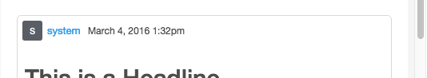

# Classes CSS de Storify{#storify-css-classes}

Classes CSS disponíveis para seus aplicativos de Storify.

Use o CSS para personalizar seus aplicativos de Storify para obter uma integração mais completa com sua página, basta substituir o CSS padrão pela sua própria folha de estilo. Esta seção descreve as personalizações de CSS disponíveis.

## Elementos do autor {#section_tdy_hsh_xz}

Permite personalizar o estilo para o avatar do autor da postagem, nome do autor e carimbo de data e hora.

| Classe | Descrição |
|---|---|
| . s-author-name | Autor |
| . s-author-avatar | O avatar do autor. |
| . s-img | A imagem do avatar do autor. |
| . s-timestamp | O carimbo de data e hora para o conteúdo de data foi publicado. |

## Elementos do cabeçalho {#section_nbv_gsh_xz}

Permite personalizar a seção de cabeçalho da página da história.

| **Classe** | **Descrição** |
|---|---|
| . super-header | Cabeçalho principal |
| . outer-header | Linha de cabeçalho principal 1 |
| . s-countdown | Timer row contador da linha de cabeçalho principal |
| . s-livtness | Status da linha de cabeçalho principal 1 «Live» |
| . base-header | Linha de cabeçalho principal 2 |
| . s-menu suspenso | Acionador suspensa da linha do cabeçalho principal 2 Classificar. |
| menu. s-dropdown | Menu suspenso da linha de cabeçalho main Classificar. |
| . s-dropdown-triângulo | Linha do cabeçalho principal 2 Classificação do menu suspenso Classificar. |
| opção. s-drop-drop | Cabeçalho da linha do cabeçalho principal 2 Classificar o item de menu suspenso. |
| . s-views | Número 2 de visualizações do cabeçalho principal. |
| botão. s-share-button | Botão Compartilhar linha 2 do cabeçalho principal. |
| . s-share-menu | Menu de compartilhamento da linha de cabeçalho principal 2. |

## Elementos de postagem {#section_lrs_fsh_xz}

Permite personalizar o estilo para os elementos da história da postagem.

| **Classe** | **Descrição** |
|---|---|
| . s-liveblog | Contêiner para todo o elemento da História |
| . s-post | O contêiner de publicação |
| . s-modal-content | Contêiner modal posterior |
| . s-element-content | Todos os elementos de conteúdo dentro de uma publicação |
| . s-element-text | Elemento de texto |
| . s-element-text h 2 | Título do elemento de texto |
| . s-element-text p | Parágrafo do elemento de texto |
| . s-element-text | Lista não ordenada do elemento de texto |
| . s-element-text | Lista ordenada do elemento de texto |
| . s-element-text li | Itens de lista de elementos de texto |
| . s-element-text blockquote | Citação blockquote |
| . s-element-text blockquote: before | O ícone para o início de uma citação blockquote |
| . s-element-text blockquote: after | O ícone para o fim de uma citação blockquote |
| . s-element-image | Contêiner de elemento de imagem em linha |
| . s-img | `` element |
| . s-image-caption | Legenda para imagens e vídeos encontrados em mídia social (ex: Imagem do Instagram) |
| . s-upload-image-caption | Legenda para imagens e vídeos carregados pelo editor de história |
| . s-element-video | Elemento de vídeo |
| . s-element-quote | Elemento de citação (ex: Apenas tweet com texto) |
| . s-element-quote-image | Elemento de aspas/texto (ex: Tweet w/image) |
| . s-element-quote-video | Elemento de aspas/vídeo (ex: Tweet w/vídeo) |
| . s-link-body | Visualização do link dentro de uma citação (ex: Visualização de tweet w/link) |

## Elementos do rodapé {#section_ozc_zrh_xz}

Permite personalizar a seção de rodapé para cada publicação individual.

| **Classe** | **Descrição** |
|---|---|
| . s-post-footer | O rodapé da publicação. |
| . s-sidenotes a | O botão Sidenotes no rodapé da publicação. |
| . s-like | O botão «Curtir» no rodapé da publicação. |
