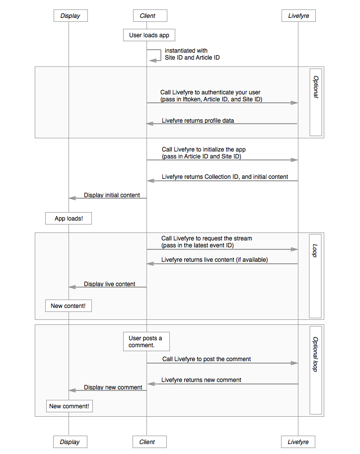

# Arquitetura{#architecture}

Saiba mais sobre as convenções do Livefyre e como o Livefyre organiza o conteúdo.

Esta seção fornece uma visão geral da arquitetura de rede Livefyre.

## Visão geral de redes e sites

O Livefyre organiza usuários e conteúdo por rede e site. Cada rede pode ter uma ou mais contas de usuário associadas a ela e cada rede pode incluir um ou mais sites do Livefyre. Um site Livefyre é um agrupamento arbitrário de Coleções. Uma coleção mapeia para uma ID de artigo em seu CMS.

## Noções básicas sobre redes {#section_hqt_4m4_xz}

Clientes com vários domínios podem compartilhar contas de usuário em todos os domínios, usando uma única rede Livefyre. Os clientes que desejam manter contas de usuário separadas para domínios diferentes exigirão redes Livefyre separadas.

As configurações podem ser aplicadas a sites, redes e coleções (referido como conversação na ilustração acima).

>[!NOTE]
>
>Algumas configurações estão disponíveis somente no nível da rede (como preferências de notificação por email, email a partir de endereço e logotipos personalizados por email). Se desejar que essas configurações sejam diferentes para cada domínio, use várias redes.

## Entendendo os sites {#section_vjw_nm4_xz}

Um site é um agrupamento arbitrário de artigos. O agrupamento é útil, pois permite atribuir moderadores diferentes a grupos de conteúdo diferentes. Os moderadores e proprietários podem ser configurados para moderar o conteúdo e definir as configurações administrativas no nível da rede ou do site. Se você desejar que alguns moderadores vejam apenas determinadas Coleções, essas Coleções podem ser configuradas como um site separado do Livefyre.

>[!NOTE]
>
>Não há limite para o número de sites que você pode ter em sua rede personalizada.

## Diagrama de sequência do aplicativo {#section_mw2_lm4_xz}

Se você deseja implementar uma função personalizada com endpoints fornecidos pela Livefyre ou simplesmente precisa depurar um problema, isso ajuda a entender como o fluxo de solicitação/resposta do aplicativo Livefyre funciona.

1. Quando o cliente acessa o site, instancie o aplicativo Livefyre com a ID do site e a ID do artigo.
1. Se desejar autenticar o usuário (valioso para avaliação de tráfego, bem como proteção do site), envie o Livefyre para as informações do site e o token do Perfil do usuário.
1. Envie o Livefyre para a ID do site e a ID do artigo para inicializar o aplicativo.

   Livefyre retorna o conteúdo inicial.

   Envie este conteúdo para a página e exiba o aplicativo.

1. Para atualizar o conteúdo exibido na página, envie o Livefyre para a ID de evento mais recente da sua página. Se algum novo conteúdo estiver disponível, ele será retornado.

   Recarregue sua página com novo conteúdo e repita o processo indefinidamente.

1. Se você permitir que os usuários publiquem novo conteúdo, acione um evento quando o novo conteúdo for postado em seu site para postar o conteúdo no Livefyre. O Livefyre retornará um fluxo atualizado, que pode ser usado para atualizar seu site.
