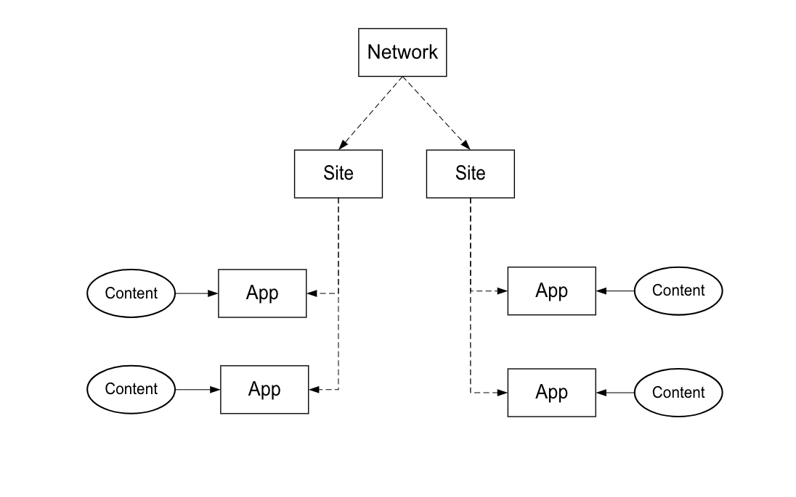

# Processo de implementação{#implementation-process}

O período de tempo para implementar o Livefyre depende da implementação e do escopo do trabalho.

## Visão geral da arquitetura de rede Livefyre {#section_dgj_l32_rbb}

Livefyre usa os seguintes termos em discutir a arquitetura de rede:

* Rede. O domínio de nível mais alto no qual você planeja usar o Livefyre.
* Sites. Um subdomínio ou seção de site que faz parte da rede.
* Aplicativos. Uma renderização do conteúdo no site. O conteúdo é exibido nos aplicativos visualmente, usando Aplicativos de visualização (Mosaic, Carrossel, Cartão de recursos etc.) ou no formato de texto, usando aplicativos de Conversação (Comentários, Revisões, Chat etc.). Você pode colocar um ou mais aplicativos em seus sites.
* Fluxos. Os fluxos são filtros que pesquisam redes sociais e outros sites para coletar conteúdo automaticamente para moderação ou publicação direta em um aplicativo.
* Conteúdo (por exemplo, UGC, comentários). O que é exibido nos aplicativos. O conteúdo pode ser visual (por exemplo, uma foto ou vídeo), somente áudio ou texto.

O diagrama a seguir mostra a relação entre Rede, Sites, Aplicativos e Conteúdo.

Você tem sua própria instância do Livefyre, que é o painel central para moderar conteúdo, gerenciar usuários e muito mais. Entre em contato com o CSM para obter acesso à instância do Livefyre.

## Etapas de integração {#section_s2j_d2x_tz}

Há três etapas principais para integrar o Livefyre:

* Integração de aplicativos

   Ao implementar o Livefyre, o estilo de implementação depende do seu caso de uso. Para [mais sobre cada tipo de implementação](/help/implementation/c-getting-started/c-implementation-process/c-app-integration-types.md#c_app_integration_types).

* Integração de autenticação

   Você deve integrar seu sistema de gerenciamento de usuários existente com o Livefyre para aplicativos de Conversação e qualquer outro aplicativo que exija autenticação de usuário final em seu site. Se, atualmente, você não usa uma ferramenta de gerenciamento de usuários, pode usar o Livefyre Identity. Para [mais informações sobre a identidade do Livefyre, o que é e como configurá-la](/help/implementation/c-livefyre-identity-comp/c-livefyre-identity-comp.md#c_livefyre_identity).

* Personalização

   A personalização é opcional, mas a maioria dos clientes personaliza os aplicativos para que caibam em sua marca.
