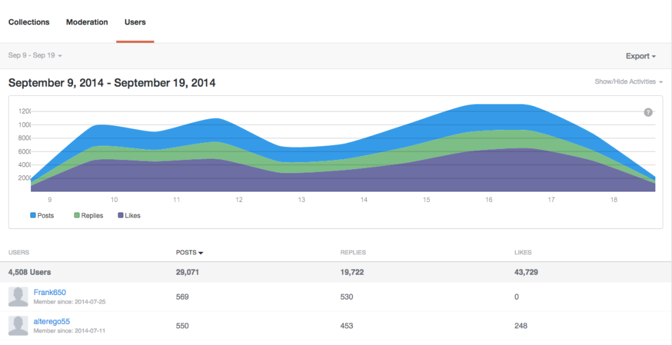

# Analytics{#analytics}

Analise a atividade de usuário, conteúdo e moderador do site.

## Analytics {#topic_22D8FAE581CD440EA02B1595520F60C2}

Analise a atividade de usuário, conteúdo e moderador do site.

O Livefyre Analytics fornece acesso aos dados de rede em painéis fáceis de ler, moderação e dados do usuário. Use esses painéis para monitorar a atividade e executar análises rápidas em seu (s) site (s).

Os painéis podem ser filtrados por site, data e atividade. Use o pulldown Rede na parte superior esquerda da janela para selecionar um site que será exibido. Depois de gerado, clique em um cabeçalho da coluna para classificar ou passe o mouse sobre o gráfico para obter informações mais específicas sobre qualquer ponto de dados.

Esta página descreve:

* Selecionar um intervalo [de datas](https://answers.livefyre.com/livefyre-studio-version-1/studio/analytics/#DateRange) para seu painel
* [Mostrar/ocultar atividades disponíveis](https://answers.livefyre.com/livefyre-studio-version-1/studio/analytics/#ShowHideActivities)
* [Exportação de dados do painel](https://answers.livefyre.com/livefyre-studio-version-1/studio/analytics/#ExportDashboardData)
* [O Painel de coleções](https://answers.livefyre.com/livefyre-studio-version-1/studio/analytics/#CollectionsDashboard)
* [O Painel de moderação](https://answers.livefyre.com/livefyre-studio-version-1/studio/analytics/#ModerationDashboard)
* [O painel de usuários](https://answers.livefyre.com/livefyre-studio-version-1/studio/analytics/#UsersDashboard)

>[!NOTE]
>
>No momento, o Analytics suporta atividades originadas dos Aplicativos principais do Livefyre e da Moderação. A maioria das atividades incluídas nesses painéis também estão disponíveis por meio [de Eventos javascript do Livefyre](https://answers.livefyre.com/developers/reference/app-customizations/javascript-events/), que podem ser usadas para potencializar sua própria ferramenta de análise personalizada ou de terceiros.

## Intervalo de datas {#concept_798C438120E643B6BE262C9997DC87C4}

Clique no menu de datas para selecionar um intervalo para exibição. Use as datas rápidas ou selecione uma data de início e fim nos calendários fornecidos.

Datas rápidas:

* **Hoje:** Exibe dados da meia-noite da manhã do dia atual, até a última hora completa antes desse momento.
* **Ontem:** Exibe os dados de 24 horas anteriores.
* **7 dias:** Exibe os dados de 7 dias anteriores, não incluindo hoje.
* **30 dias:** Exibe os dados de 30 dias anteriores, não incluindo hoje.
* **Esta semana:** Exibe dados da meia-noite da manhã do último domingo, até a última hora completa antes desse momento.
* **Este Mês:** Exibe dados da meia-noite da manhã do primeiro dia do mês atual, até a última hora completa antes desse momento.
* **Semana passada:** Exibe os dados da semana passada.
* **Último mês:** Exibe os dados do mês anterior.

## Mostrar/ocultar atividades {#concept_022D9851CBCE4A2FB80D0AE52A23744D}

As atividades são ações que os usuários tomam no site, incluindo comentários, sinalização, compartilhamento e moderação. Use o **menu suspenso Mostrar/ocultar atividades** para selecionar atividades que deseja incluir no painel.

>[!NOTE]
>
>A seleção de novos eventos para o filtro renderizará novamente a página sem alterar o URL.

As atividades disponíveis variam por tipo de painel e exportação, e podem incluir:

* **Postagens:** Exibe dados da meia-noite da manhã do dia atual, até a última hora completa antes desse momento.
* **Respostas:** Exibe os dados de 24 horas anteriores.
* **Curtidas:** Exibe os dados de 7 dias anteriores, não incluindo hoje.
* **Descurtidas:** Exibe os dados de 30 dias anteriores, não incluindo hoje.
* **Contém Mídia:** Exibe dados da meia-noite da manhã do último domingo, até a última hora completa antes desse momento.
* **A postagem tem upload de fotos:** Exibe dados da meia-noite da manhã do primeiro dia do mês atual, até a última hora completa antes desse momento.
* **A postagem tem link:** Exibe os dados da semana passada.
* **A postagem tem @ menções:** Exibe os dados do mês anterior.
* **Aprovado:** Exibe os dados do mês anterior.
* **Bozo'd:** Exibe os dados do mês anterior.
* **Trava:** Exibe os dados do mês anterior.
* **Total de moderação:** Exibe os dados do mês anterior.

## Exportação de dados do painel {#concept_730DB61A9F894BE6BFB34E0E2A421ED3}

Use o menu **suspenso Exportar** para exportar os dados do painel como um arquivo CSV.

* Resumo diário (apenas coleções): exporta o tallies diário da semana completa para cada coleção.
* Dados da tabela: exporta todos os dados de coleções combinadas (todas as colunas e todas as linhas no relatório atual).
* Dados brutos: exporta todos os eventos individuais usados para criar o relatório acumulado atual.

>[!NOTE]
>
>Esses relatórios podem levar alguns minutos para exportar. Todos os carimbos de data e hora são Unix.

## Coleções {#concept_228D8E5553784DB8BABF3819A5FF0345}

O painel Coleções lista a atividade do usuário pela coleção, permitindo determinar a maior parte (e menos) conteúdo envolvente. Cada coleção listada inclui um link para a página na qual ele pode ser encontrado.

## Moderação {#concept_98689B1E804B43CEA21E3F456107CCD9}

O painel de Moderação lista eventos por moderador, permitindo avaliar suas atividades. Use este relatório para encontrar os Moderadores mais ativos e as ações de moderação mais comuns.

>[!NOTE]
>
>As atividades automatizadas de moderação do Livefyre serão listadas para o nome do moderador Livefyre System.

## Usuários {#concept_D1A83E31C7B5467F9C844CBF9A740E12}

O painel Usuários mostra a atividade do site por usuário, permitindo analisar como os usuários individuais interagem com o site. Use esse painel para encontrar os usuários mais ativos no site e avaliar as atividades mais populares do site.

