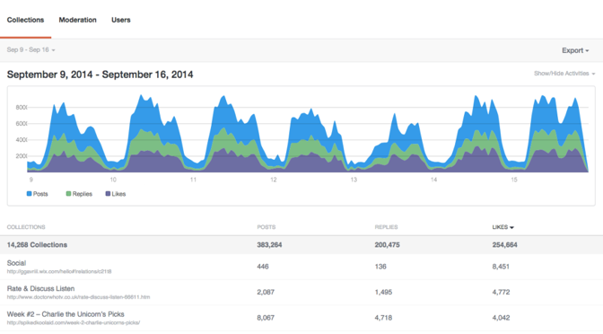

# Analytics{#analytics}

Analise as atividades de usuário, conteúdo e moderador do seu site.

## Analytics {#topic_22D8FAE581CD440EA02B1595520F60C2}

Analise as atividades de usuário, conteúdo e moderador do seu site.

O Livefyre Analytics fornece acesso aos dados de sua rede para facilitar a leitura de painéis para conversas, moderação e dados do usuário. Use esses painéis para monitorar a atividade e executar análises rápidas em seu(s) site(s).

Os painéis podem ser filtrados por site, data e atividade. Use o menu suspenso Rede na parte superior esquerda da janela para selecionar um site a ser exibido. Depois de gerado, clique em um cabeçalho de coluna para classificar ou passe o mouse sobre o gráfico para obter informações mais específicas sobre qualquer ponto de dados.

Esta página descreve:

* Selecionar um intervalo de datas para seu painel
* Exibir/ocultar atividades disponíveis
* Exportar dados do painel
* O painel Coleções
* O painel de moderação
* O painel Usuários

>[!NOTE]
>
>Atualmente, o Analytics suporta atividades originadas dos aplicativos principais e da moderação do Livefyre. A maioria das atividades incluídas nesses painéis também está disponível por meio dos Eventos JavaScript do Livefyre, que podem ser usados para potencializar sua própria ferramenta de análise personalizada ou de terceiros.

## Intervalo de datas {#concept_798C438120E643B6BE262C9997DC87C4}

Clique no menu suspenso de datas para selecionar um intervalo a ser exibido. Use as datas rápidas ou selecione uma data inicial e final nos calendários fornecidos.

Datas rápidas:

* **Hoje:** Exibe dados da meia-noite na manhã do dia atual, até a última hora completa antes deste momento.
* **Ontem:** Exibe os dados das 24 horas anteriores.
* **7 dias:** Exibe os dados dos 7 dias anteriores, não incluindo hoje.
* **30 dias:** Exibe os dados dos 30 dias anteriores, não incluindo hoje.
* **Nesta Semana:** Exibe dados da meia-noite na manhã do último domingo, até a última hora completa antes deste momento.
* **Este mês:** Exibe dados da meia-noite na manhã do primeiro dia do mês atual, até a última hora completa antes deste momento.
* **Semana Passada:** Exibe os dados da semana passada.
* **Último mês:** Exibe os dados do mês passado.

## Exibir/ocultar atividades {#concept_022D9851CBCE4A2FB80D0AE52A23744D}

Atividades são ações que os usuários tomam em seu site, incluindo comentários, sinalização, compartilhamento e moderação. Use o **Exibir/ocultar atividades** selecione atividades que deseja incluir no painel.

>[!NOTE]
>
>Selecionar novos eventos para o filtro renderizará novamente a página sem alterar o URL.

As atividades disponíveis variam por tipo de painel e exportação, e podem incluir:

* **Publicações:** Exibe dados da meia-noite na manhã do dia atual, até a última hora completa antes deste momento.
* **Respostas:** Exibe os dados das 24 horas anteriores.
* **Curtidas:** Exibe os dados dos 7 dias anteriores, não incluindo hoje.
* **Descurtidas:** Exibe os dados dos 30 dias anteriores, não incluindo hoje.
* **Contém mídia:** Exibe dados da meia-noite na manhã do último domingo, até a última hora completa antes deste momento.
* **Postagem tem upload de foto:** Exibe dados da meia-noite na manhã do primeiro dia do mês atual, até a última hora completa antes deste momento.
* **A publicação tem link:** Exibe os dados da semana passada.
* **Postagem tem @menções:** Exibe os dados do mês passado.
* **Aprovado:** Exibe os dados do mês passado.
* **Bozo&#39;d:** Exibe os dados do mês passado.
* **Lixeira:** Exibe os dados do mês passado.
* **Total de moderação:** Exibe os dados do mês passado.

## Exportar dados do painel {#concept_730DB61A9F894BE6BFB34E0E2A421ED3}

Use o **Exportar** menu suspenso para exportar seus dados de painel como um arquivo CSV.

* Resumo diário (somente coleções): exporta as últimas tabelas diárias da semana completa para cada Coleção.
* Dados da tabela: exporta todos os dados de Coleções submetidas a rollup (todas as colunas e todas as linhas no relatório atual).
* Dados brutos: exporta todos os eventos individuais usados para criar o relatório de rollup atual.

>[!NOTE]
>
>Esses relatórios podem levar alguns minutos para serem exportados. Todos os carimbos de data e hora são de hora Unix.

## Coleções {#concept_228D8E5553784DB8BABF3819A5FF0345}

O painel Coleções lista a atividade do usuário por Coleção, permitindo determinar o conteúdo mais envolvente (e menos importante). Cada Coleção listada inclui um link para a página na qual pode ser encontrada.

## Moderação {#concept_98689B1E804B43CEA21E3F456107CCD9}

O painel Moderação lista eventos por moderador, permitindo avaliar sua atividade. Use este relatório para encontrar seus Moderadores mais ativos e suas ações de moderação mais comuns.

>[!NOTE]
>
>As atividades automatizadas de moderação do Livefyre serão listadas para o nome do moderador Livefyre System.

## Usuários {#concept_D1A83E31C7B5467F9C844CBF9A740E12}

O painel Usuários mostra a atividade do site por usuário, permitindo analisar como usuários individuais interagem com seu site. Use esse painel para encontrar seus usuários mais ativos em todo o site e avaliar as atividades mais populares do site.

