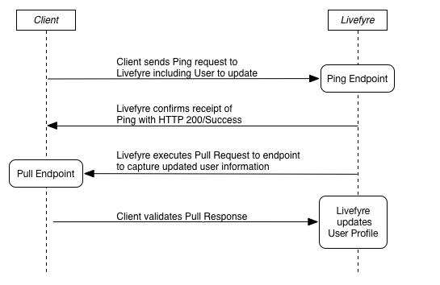

# Sincronizar com o Livefyre usando Ping para Extrair{#sync-with-livefyre-using-ping-for-pull}

Use Ping para Extrair para manter o Livefyre sincronizado com o sistema de gerenciamento de usuários.

Em geral, ***você ping*** o Livefyre sempre que um usuário do seu site/aplicativo atualizar seu perfil (nome de exibição, avatar etc.) e o Livefyre ***puxará*** o perfil atualizado do usuário.

Ping para sequência de puxar:

1. O cliente envia a solicitação Ping para o Livefyre (incluindo o Usuário a ser atualizado).
1. Livefyre confirma recibo de Ping com HTTP 200/Success.
1. O Livefyre processa a solicitação Pull.
1. Livefyre enfileira solicitações.
1. O Livefyre executa a solicitação extraída para endpoint para capturar informações atualizadas do usuário.
1. O cliente recebe a resposta Pull e valida.
1. O Livefyre atualiza Perfis remotos com as informações de perfil externo incluídas no endpoint de extração.

Ping do Livefyre sempre que um usuário atualizar suas informações de perfil. Enquanto o ping para o tempo de conclusão de puxar pode variar dependendo do carregamento da rede, atualizará as informações do usuário entre 1 e 10 minutos. As alterações de perfil atualizadas serão exibidas primeiro no Livefyre Studio > Usuários.

As informações de perfil atualizadas aparecerão nos aplicativos do Livefyre após dois eventos:

* Um usuário faz logout e faz logon novamente no aplicativo. Os valores de nome de exibição no userauthtoken têm prioridade sobre o Ping para obter atualizações. O logout/login do usuário atualizará o token para atualizar a sessão.

   Para gerar novo userauthtokens quando as informações do perfil forem atualizadas, use o SSO authdelegate para registrar seu usuário em segundo plano e em segundo plano.

* Uma atualização de carregamento automático da coleção será trazida para as informações atualizadas (no máximo a cada 5-10 minutos).

Para implementar o Ping para puxar para o sistema do perfil do usuário:

1. [Crie o endpoint de extração](#t_build_the_pull_endpoint).

   >[!NOTE]
   >
   >A biblioteca do Livefyre inclui um método syncuser para manter os perfis de usuário atualizados. Ignore as próximas duas etapas se você usar a biblioteca do Livefyre.

1. [Registre o endpoint de extração no Studio](#register_the_endpoint_with_studio).
1. [Construa o ping](#t_build_the_ping).
1. [Crie o ping para obter resposta].(# reference_ n 3 x_ pzb_ mz)
