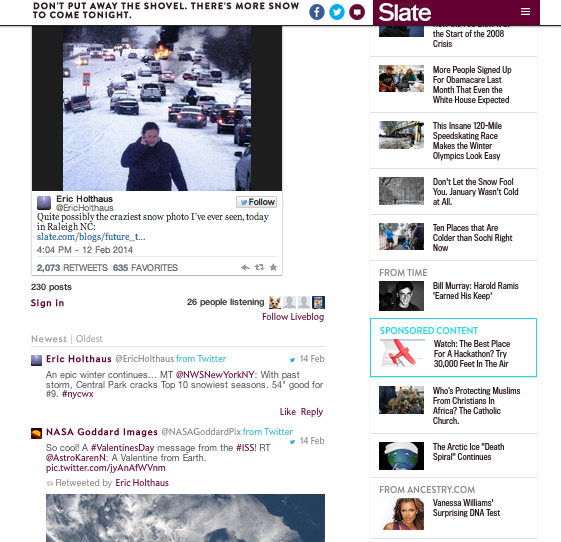

# Blog ao vivo{#live-blog}

O Live Blog permite que seus autores e editores postem atualizações em tempo real, transformando seu site em uma fonte de notícias envolvente.

As publicações da sua equipe, repletas de imagens, vídeo, áudio e conteúdo incorporado, tornam-se a fonte de novas conversas e encadeamentos. O Live Blog é perfeito quando implantado para revelações de produtos, programas de premiação e eventos esportivos.

O Blog ao vivo é diferente dos Comentários das seguintes maneiras:

* Somente proprietários e moderadores podem ver a caixa de comentários e criar publicações de nível superior.
* As respostas dos usuários podem ser desativadas para criar uma experiência apenas para blogueiros.
* Os usuários podem gravar, carregar fotos ou postar links incorporados de seu computador ou dispositivo móvel.
* A fonte do comentário é maior e os avatares são menores para enfatizar o conteúdo.
* Os avatares podem ser desativados, se desejado.

Com a chegada de outra tempestade de neve, Slate quis fornecer aos leitores atualizações instantâneas sobre as oscilações do tempo selvagem na Costa Leste. Usando um Live Blog, editores da Slate foram capazes de compartilhar instantaneamente atualizações sobre a tempestade, incluindo suas próprias fotos, tweets de usuários e informações sobre a queda de neve. O Live Blog foi tão útil que tornou a página inicial do site da Slate.

