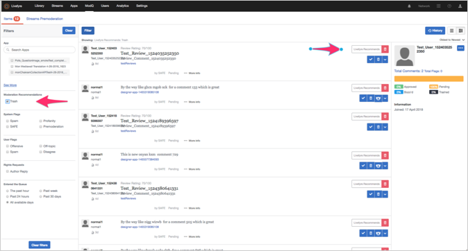

# Regras SAFE{#safe-rules}

O Livefyre Spam and Abuse Filtering Engine (SAFE) é um processo em segundo plano que analisa todo o conteúdo recebido e é ativado para todos os clientes do Livefyre.

O SAFE usa regras de padrão, bem como modelos estatísticos para detectar spam, abuso, profanidade e publicações em massa (repetitivas). Você verá uma referência a ele ocasionalmente em outros produtos do Livefyre, principalmente nas ferramentas de moderação de conteúdo e no ModQ.

>[!NOTE]
>
>SAFE é somente em inglês, exceto para classificação de correspondência em massa. Se precisar de suporte para outros idiomas, entre em contato com o Gerente de conta estratégica.

## Componentes do Studio usando SAFE {#section_k34_4tx_vy}

Sinalizadores aplicados pelo SAFE podem ser usados com os seguintes componentes do Studio:

* Regras

   Você pode definir regras SAFE para sinalizar automaticamente o conteúdo e definir como o conteúdo sinalizado deve ser manipulado no **[!UICONTROL Network Settings]**.

   Por exemplo, um site pode definir uma tolerância muito baixa para Profanidade e definir Regras SAFE que definem todo o conteúdo sinalizado como Perfil como Bozo’d. Outros sites podem definir Regras que definem o conteúdo do Perfil para ser pré-moderado antes de entrar no fluxo.

* ModQ

   Você pode moderar o conteúdo sinalizado por regras SAFE e outras regras de pré-moderação (por exemplo, SPAM, profanidade etc.), no ModQ.

* Conteúdo do aplicativo na biblioteca

   O conteúdo sinalizado por SAFE está listado no Conteúdo do aplicativo na guia **[!UICONTROL Library]** . Você pode filtrar o conteúdo por sinalizadores para moderar o conteúdo.

## Opções de filtro SAFE {#section_pg5_ttx_vy}

O SAFE aplica os seguintes sinalizadores ao conteúdo filtrado e pode ser usado para criar regras e moderar conteúdo no Livefyre Studio.

* **[!UICONTROL Profanity List]**: Conteúdo de perfil, conforme definido por uma lista de palavras-chave em inglês, com base no uso comum.

   O Filtro de Profanação busca linguagem profana, com base em uma lista de palavras testadas. Se detectado, o conteúdo é sinalizado como Perfil.

   >[!NOTE]
   >
   >Livefyre também fornece um segundo filtro de Lista de perfis, que pode ser personalizado nos níveis de Site e Rede. As regras criadas com a Lista de Profanação terão precedência sobre as regras automatizadas provenientes do filtro de Profanação SAFE. Para obter mais informações, consulte a seção Lista de perfis na documentação Configurações .

* **[!UICONTROL Mild Profanity]**: Palavras e frases geralmente não são aceitáveis em conversas educadas, mas geralmente são aceitáveis em conversas casuais. Geralmente, essas palavras e frases são permitidas na televisão em rede.
* **[!UICONTROL Strong Profanity]**: Um idioma muito forte, como explementos e frases não permitidos na televisão em rede e usados com moderação em filmes com classificação R e programas maduros de TV a cabo. Geralmente, essas palavras não são usadas em conversas educadas ou casuais e são ditas em uma conversa pouco educada com a intenção de prejudicar o ouvinte.
* **[!UICONTROL SPAM]**: Conteúdo não solicitado, geralmente comercial. Ele usa um modelo estatístico que depende de uma variedade de recursos (incluindo conteúdo de comentários e URLs) para marcar um conteúdo como SPAM. Você pode ajustar limites de spam para personalizar as taxas de marcação de SPAM para sua rede ou site, por solicitação.
* **[!UICONTROL Mild Insult]**: Conteúdo insultuoso, conforme definido por uma lista de palavras-chave e padrões de frases.
* **[!UICONTROL Strong Insult]**: Conteúdo insultuoso, conforme definido por uma lista de palavras-chave e padrões de frases.
* **[!UICONTROL Hate Speech]**: Um insulto com base na etnia ou religião, especialmente quando a afiliação do grupo-alvo estiver em minoria ou protegida.
* **[!UICONTROL ALL CAPS]**: Texto apresentado em todas as letras maiúsculas (lido como gritando).
* **[!UICONTROL Mild Threat]**: Uma ameaça ou insulto que costuma incluir algum tipo de profanidade leve direcionada a outra pessoa. Essa opção sinaliza possíveis ameaças com mais frequência, mas também tem uma taxa de falso-positivo mais alta do que **[!UICONTROL Strong Threat]**.

* **[!UICONTROL Strong Threat]**: Uma ameaça séria ou insulto que menciona danos corporais acionáveis para uma ou mais pessoas, muitas vezes com forte profanidade. Essa opção sinaliza possíveis ameaças com menos frequência, mas também tem uma taxa de falso-positivo mais baixa do que **[!UICONTROL Mild Threat]**.

* **[!UICONTROL Probable Nudity]**: Uma imagem que pode ter nudez nela. Essa opção sinaliza a nudez com menos frequência, mas também tem uma taxa de falso-positivo mais baixa que **[!UICONTROL Possible Nudity]**.

* **[!UICONTROL Possible Nudity]**: Uma imagem que pode ter nudez nela. Essa opção sinaliza a nudez com mais frequência, mas também tem uma taxa de falso-positivo mais alta do que **[!UICONTROL Probable Nudity]**.

* **[!UICONTROL PII]** (Informações pessoais identificáveis): Informações que podem identificar o usuário. Isso pode incluir um endereço de email, endereço físico, número da segurança social (para clientes dos EUA), número de cartão de crédito, uma senha ou qualquer coisa que possa ser usada em fraudes ou para obter a identidade de alguém.
* **[!UICONTROL Livefyre Recommends Trash]**. Defina a ação que o sistema executa quando a Recomendação de moderação automatizada identifica o conteúdo para rejeição.  

   >[!NOTE]
   >
   >Para ativar o Moderation Recommendations, entre em contato com seu profissional de suporte do Adobe Livefyre.

## Manuseio de conteúdo não capturado pelo SAFE {#section_pjy_5tx_vy}

Há vários meios disponíveis para lidar com conteúdo não capturado por esse filtro. As opções abaixo são listadas na ordem de processo recomendada.

1. Como moderador, remova o conteúdo do fluxo.
1. Crie uma Regra de Sinalizador que indique que, se um conteúdo for sinalizado como Spam ou Ofensivo por cinco usuários, defina-o como Bozo.
1. Proibir o usuário que está postando conteúdo indesejado, de modo que todo o seu conteúdo irá diretamente para o estado Bozo.
1. Adicione palavras específicas que devem sempre ser filtradas na sua lista de perfis.

>[!NOTE]
>
>Se um moderador publicar o conteúdo capturado pelo nosso Filtro de spam, ele ainda será sinalizado como Spam, mas será automaticamente Aprovado e não será definido como Bozo.

Se você notar tendências ou padrões de conteúdo não capturados pelo SAFE, envie por email seus CSM com as IDs de comentário e o texto.

Aplicativos que usam este recurso:

* [Carrossel](/help/using/c-about-apps/c-carousel-app/c-carousel-app.md#c_carousel_app)
* [Bate-papo](/help/using/c-about-apps/c-chat-app/c-chat-app.md#c_chat_app)
* [Comentários](/help/using/c-about-apps/c-comments/c-comments.md)
* [Placa de recurso](/help/using/c-about-apps/c-feature-card-app/c-feature-card-app.md#c_feature_card_app)
* [Mapa](/help/using/c-about-apps/c-map-app/c-map-app.md#c_map_app)
* [Mural de mídia](/help/using/c-about-apps/c-media-wall-app/c-media-wall-app.md#c_media_wall_app)
* [Mosaico](/help/using/c-about-apps/c-mosaic-app/c-mosaic-app.md#c_mosaic_app)
* [Resenhas](/help/using/c-about-apps/c-reviews-app/c-reviews-app.md#c_reviews_app)
* [Observações](/help/using/c-about-apps/c-sidenotes-app/c-sidenotes-app.md#c_sidenotes_app)
* [Storify 2](/help/using/c-about-apps/c-storify2/c-storify2.md#c_storify2)
* [Botão Upload](/help/using/c-about-apps/c-upload-button-app/c-upload-button-app.md#c_upload_button_app)
