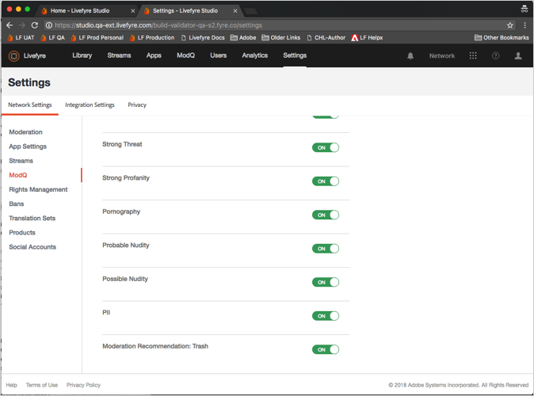

# Configuração da moderação{#setting-up-moderation}

Use a guia Moderação para definir regras de pré-moderação para o conteúdo de entrada, incluindo listas de profanidade, regras de sinalização e endereços IP proibidos.

## Como a moderação funciona {#section_kyf_gvc_t1b}

Você pode moderar o conteúdo das seguintes maneiras:

* Pré-moderar automaticamente o conteúdo para filtrar o conteúdo indesejado com base em regras configuradas antes de publicar o conteúdo.
* Exclua ou aprove manualmente o conteúdo que foi sinalizado usando a pré-moderação automática usando o ModQ ou Conteúdo do aplicativo na Biblioteca.
* Identifique visitantes do site que postam repetidamente conteúdo ofensivo para impedi-los de postar proibindo usuários específicos do Livefyre, usuários sociais ou endereços IP.
* Identifique pessoas e conteúdo que podem sempre ser exibidos ao permitir a listagem de usuários ou ao desativar filtros para fluxos, sites ou redes específicos.

Você pode pré-moderar automaticamente o conteúdo das seguintes maneiras:

* Configure regras para sinalizar automaticamente determinados tipos de conteúdo:

   * Configurar regras de sinalização para conteúdo que é sinalizado pelo sinalizador de visitantes do site usando **[!UICONTROL Settings > Moderation > Rules]**
   * Configurar regras SAFE usando **[!UICONTROL Settings > Moderation > Rules]**
   * Banir usuários específicos do Twitter usando **[!UICONTROL Settings > Streams]**
   * Bloquear endereços IP usando **[!UICONTROL Settings > Bans]**
   * Proibir regiões IP por código de país por solicitação. O conteúdo proibido será marcado como SPAM.

* Crie uma lista de palavras que você considera profanidade na Lista de perfis em **[!UICONTROL Settings > Moderation > Rules]** para sua rede ou site.
* Permitir usuários da lista de permissões (sempre permitir que o conteúdo desses usuários seja exibido) usando ou desativando filtros para fluxos, sites ou redes específicos.

Depois de configurar suas listas de profanidade, filtros SAFE e regras, você pode escolher se deseja pré-moderar o conteúdo e aplicar os filtros SAFE em fluxos. Para obter mais informações, consulte [Opções de regra de fluxo para todas as regras de fluxo](/help/using/c-streams/c-stream-rule-options-for-all-stream-rules.md#c_stream_rule_options_for_all_stream_rules).

Livefyre marca o conteúdo como **[!UICONTROL Approved]**, **[!UICONTROL Pending]**, **[!UICONTROL Junk]**, etc. dependendo de onde o conteúdo vem, de onde ele será publicado e de quais regras você configurou no sistema. A tabela a seguir descreve as ações que o Livefyre toma, dependendo desses fatores, em detalhes.

## Como a moderação funciona

| O conteúdo vem de: | Enviar conteúdo para: | Status da aprovação |
|--- |--- |--- |
| Biblioteca | Aplicativo | Conteúdo aprovado |
| Pesquisa social | Aplicativo | Conteúdo aprovado |
| Regra de fluxo | Aplicativo | O conteúdo está marcado como Lixo Eletrônico pelo filtro SAFE?  <ul><li>Não - Fluxo de trabalho de moderação de fluxo para aplicativo</li><li>Sim - Conteúdo enviado para a lixeira</li></ul> |
| Biblioteca | Pasta | Nenhum status (na pasta, não publicado, não enviado para a lixeira) |
| Pesquisa social | Pasta | Nenhum status (na pasta, não publicado, não enviado para a lixeira) |
| Regra de fluxo | Pasta | O conteúdo está marcado como Lixo Eletrônico pelo filtro SAFE?  <ul><li>Não - Nenhum status (na pasta, não publicado, não enviado para a lixeira)</li><li>Sim - Conteúdo enviado para a lixeira</li></ul> |
| Publicação do aplicativo | Aplicativo | O conteúdo está marcado como Lixo Eletrônico pelo filtro SAFE?  <ul><li>Não - Fluxo de trabalho de moderação pós-aplicativo</li><li>Sim - Conteúdo enviado para a lixeira</li></ul> |

## Fluxo de trabalho de moderação de fluxo para aplicativo {#section_z5z_w4d_t1b}

Antes de o conteúdo de um Stream ser publicado em um aplicativo, o Livefyre executa as seguintes verificações para determinar o que fazer com o conteúdo:

1. Se SAFE sinalizar o conteúdo como lixo ou gota, o Livefyre trava o conteúdo.
1. Se SAFE não sinalizar o conteúdo como lixo eletrônico, o Livefyre verifica se a pré-moderação está ativada.
1. Se a pré-moderação estiver ativada, o Livefyre marca o conteúdo como pendente.
1. Se você configurar regras do ModQ, o Livefyre enviará o conteúdo para o ModQ.
1. Se a pré-moderação não estiver ativada, o Livefyre verifica se o SAFE sinalizou o conteúdo.
1. Se SAFE sinalizou o conteúdo, Livefyre aprova o conteúdo e publica-o no aplicativo.
1. Se SAFE sinaliza o conteúdo e você não configurou regras SAFE, Livefyre aprova o conteúdo e publica o conteúdo no aplicativo.
1. Se SAFE sinalizar o conteúdo e você configurar regras SAFE, o Livefyre verificará se você configurou regras SAFE para o Stream.
1. Se você configurar regras SAFE para o fluxo, o Livefyre aprovará o conteúdo e publicará o conteúdo no aplicativo. Se você não configurou regras SAFE para o fluxo, o Livefyre usa as regras SAFE de moderação para determinar como lidar com o conteúdo (enviar para ModQ, lixo, etc.).

## Fluxo de trabalho de moderação pós-aplicativo {#section_fwn_w4d_t1b}

Antes de o conteúdo de uma publicação do aplicativo ser publicado em um aplicativo, o Livefyre executa as seguintes verificações para determinar o que fazer com o conteúdo:

1. Se o filtro SAFE sinalizar o conteúdo como uma gota, o Livefyre soltará o conteúdo.
1. Se SAFE não sinalizar o conteúdo como gota, o Livefyre verifica se a pré-moderação está ativada. Se a pré-moderação estiver ativada, o Livefyre marca o conteúdo como pendente. Se você configurar regras do ModQ, o Livefyre enviará o conteúdo para o ModQ como pendente. Caso contrário, o conteúdo permanece em um status pendente no Conteúdo do aplicativo na Biblioteca.
1. Se a pré-moderação não estiver ativada, o Livefyre verifica se o SAFE sinalizou o conteúdo. Caso contrário, o Livefyre aprova o conteúdo e o publica no aplicativo.
1. Se SAFE sinaliza o conteúdo e você configura as regras SAFE, o Livefyre usa a regra SAFE para determinar como lidar com o conteúdo (enviar para ModQ, lixo, etc.). Se SAFE sinaliza o conteúdo e você não configurou regras SAFE, Livefyre aprova o conteúdo e publica o conteúdo no aplicativo.

## Filtros em massa {#section_lyk_ktx_vy}

O Filtro em massa busca conteúdo repetitivo publicado em todas as redes Livefyre em um curto período de tempo. Se detectado, esse conteúdo é sinalizado como em massa e enviado para a lixeira por padrão. Embora o conteúdo em massa possa ser gerado pelo usuário (como &quot;Retenção!&quot;) postada repetidamente em um Chat durante um jogo de futebol popular), a maioria é originário de campanhas de spam. Esse filtro não depende de idioma e funciona com qualquer idioma. Para personalizar o filtro em massa, você deve entrar em contato com o suporte do Livefyre.

## Regras {#section_gqz_ksk_f1b}

Use a seção Regras para criar regras de pré-moderação, com base no SAFE e nos sinalizadores aplicados pelo usuário. Esse painel oferece dois tipos de regras:

* **[!UICONTROL Flag Rules:]** especifique uma ação que deve ser executada em um comentário sinalizado por usuários por um número definido de vezes.
* **[!UICONTROL SAFE Rules:]**combina sinalizadores SAFE com ações a serem tomadas no conteúdo sinalizado.

Para criar Regras de Sinalizador, selecione o sinalizador (Ofensivo, Tópico Desativado, Discordo ou Spam), insira o número de vezes que ele deve ser aplicado a um conteúdo e selecione a ação a ser executada. É possível definir uma Regra de Sinalizador para cada opção de sinalizador (Ofensivo, Tópico desativado, Discordo ou Spam).

Você pode criar regras nos níveis de Rede, Site e Stream. As regras de nível de site herdam as regras de rede, a menos que você configure as Regras de site de forma diferente. As regras de fluxo herdam as regras do Site, a menos que você as configure de forma diferente.

Ações disponíveis:

* **[!UICONTROL Trash it:]**envia o comentário sinalizado para a lixeira.
* **[!UICONTROL Bozo it:]** oculta o comentário sinalizado de todos os usuários, exceto seu gravador, para o qual ele permanece visível.
* **[!UICONTROL Pending:]** define o conteúdo como pendente. Se você definir Premoderation como ON em **[!UICONTROL Settings > ModQ]**, ele estará no ModQ. Caso contrário, estará somente no Conteúdo do aplicativo.

>[!NOTE]
>
>Livefyre recomenda criar regras para comentários do Bozo que são sinalizados como spam ou ofensivo por cinco usuários.

## Moderação do Recommendations {#section_ec3_vr3_2cb}

Você pode usar as recomendações de moderação para ajudar a determinar como moderar o conteúdo publicado pelos visitantes do site nos aplicativos do Livefyre. O Indicador de recomendação de moderação recomenda quando é provável que um conteúdo seja descartado, com base em quais ações você tomou anteriormente em um conteúdo semelhante. Para usar o Recommendations de moderação:

1. Ative a funcionalidade Moderação do Recommendations entrando em contato com o profissional de suporte do Adobe Livefyre.
1. Defina as recomendações de moderação nas Configurações de rede.

   Configure as recomendações de moderação usando a configuração **[!UICONTROL Livefyre Recommends Trash]** em **[!UICONTROL Network Settings]**.

   

1. Configure uma regra SAFE para informar ao Livefyre o que fazer com o conteúdo que a recomendação de moderação identifica como conteúdo que provavelmente será descartado. Para obter mais informações sobre como configurar uma regra SAFE para a opção **[!UICONTROL Livefyre Recommends Trash]**, consulte [Moderação](/help/using/c-features-livefyre/c-about-moderation/c-moderation.md#c_moderation).

   

1. Use o **[!UICONTROL Moderation Recommendation Indicator]** no ModQ ou no Conteúdo do Aplicativo para filtrar o conteúdo que a recomendação de moderação identifica como passível de ser descartado.

   No ModQ, o indicador tem esta aparência:  

   Para obter mais informações sobre como usar o Recommendations de moderação para moderar o conteúdo no ModQ, consulte [ModQ](/help/using/c-features-livefyre/c-about-moderation/c-modq.md#c_modq).

   No Conteúdo do aplicativo, as recomendações de moderação têm a seguinte aparência:  

   Para obter mais informações sobre como usar o Recommendations de moderação no conteúdo do aplicativo, consulte [Moderar conteúdo usando conteúdo do aplicativo](/help/using/c-features-livefyre/c-about-moderation/c-moderate-content-using-app-content.md#c_moderate_content_using_app_content).
