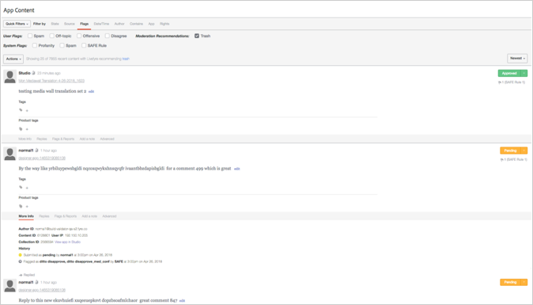

# Configuração da moderação{#setting-up-moderation}

Use a guia Moderação para definir regras de pré-moderação para o conteúdo recebido, incluindo listas de profanidade, regras de sinalização e endereços IP proibidos.

## Como a moderação funciona {#section_kyf_gvc_t1b}

Você pode moderar o conteúdo das seguintes maneiras:

* Pré-modere automaticamente o conteúdo para filtrar conteúdo indesejado com base nas regras configuradas antes de publicar o conteúdo.
* Exclua ou aprove manualmente o conteúdo sinalizado usando a pré-moderação automática usando o modq ou o Conteúdo do aplicativo na Biblioteca.
* Identifique os visitantes do site que repetidamente postam conteúdo ofensivo para mantê-los de postagem proibindo usuários específicos do Livefyre, usuários sociais ou endereços IP.
* Identifique pessoas e conteúdo que sempre podem ser exibidos por usuários em lista de permissões ou desativar filtros para fluxos, sites ou redes específicos.

Você pode pré-moderar automaticamente o conteúdo das seguintes maneiras:

* Configure regras para sinalizar automaticamente determinados tipos de conteúdo:

   * Configure regras de sinalização para o conteúdo sinalizado pelo sinalizador de visitantes do site usando **[!UICONTROL Settings > Moderation > Rules]**
   * Configure regras SEGURAS usando **[!UICONTROL Settings > Moderation > Rules]**
   * Banir usuários específicos do Twitter usando **[!UICONTROL Settings > Streams]**
   * Banir endereços IP usando **[!UICONTROL Settings > Bans]**
   * Exclua regiões IP por código de país por solicitação. O conteúdo proibido será marcado como SPAM.

* Crie uma lista de palavras que considere profanidade na Lista de perfis em **[!UICONTROL Settings > Moderation > Rules]** sua Rede ou Site.
* Usuários da lista de permissões (sempre permitir que o conteúdo desses usuários seja exibido) usando ou desativando filtros para fluxos, sites ou redes específicos.

Depois de configurar suas listas de profanidade, filtros SAFE e regras, você pode escolher se deseja moderar o conteúdo e aplicar os filtros de SAFE em fluxos. Para obter mais informações, consulte [Opções de regras de fluxo para todas as regras de fluxo](/help/using/c-streams/c-stream-rule-options-for-all-stream-rules.md#c_stream_rule_options_for_all_stream_rules).

O Livefyre marca o conteúdo como **[!UICONTROL Approved]****[!UICONTROL Pending]**, **[!UICONTROL Junk]**etc. de onde o conteúdo veio, onde ele será publicado e quais regras você configurou no sistema. A tabela a seguir descreve as ações do Livefyre, dependendo desses fatores, detalhadamente.

## Como a moderação funciona

| O conteúdo vem de: | Enviar conteúdo para: | Status de aprovação |
|--- |--- |--- |
| Biblioteca | Aplicativo | Conteúdo aprovado |
| Pesquisa social | Aplicativo | Conteúdo aprovado |
| Regra de fluxo | Aplicativo | O conteúdo marcado como Junk por filtro SAFE?  <ul><li>Não - Fluxo de trabalho de moderação de fluxo contínuo</li><li>Sim - Traço de conteúdo</li></ul> |
| Biblioteca | Pasta | Nenhum status (na pasta, não publicado, sem traço) |
| Pesquisa social | Pasta | Nenhum status (na pasta, não publicado, sem traço) |
| Regra de fluxo | Pasta | O conteúdo marcado como Junk por filtro SAFE?  <ul><li>Não - Nenhum status (na pasta, não publicado, sem traço)</li><li>Sim - Traço de conteúdo</li></ul> |
| Publicação do aplicativo | Aplicativo | O conteúdo marcado como Junk por filtro SAFE?  <ul><li>Não - Fluxo de trabalho de moderação pós-aplicativo</li><li>Sim - Traço de conteúdo</li></ul> |

## Fluxo de trabalho de moderação de fluxo contínuo {#section_z5z_w4d_t1b}

Antes do conteúdo de um Fluxo ser publicado em um aplicativo, o Livefyre realiza as seguintes verificações para determinar o que fazer com o conteúdo:

1. Se a SAFE sinalizar o conteúdo como junk ou solto, o Livefyre trava o conteúdo.
1. Se o SAFE não sinalizar o conteúdo como junk, o Livefyre verificará se a moderação está ativada.
1. Se a pré-moderação estiver ativada, o Livefyre marca o conteúdo como pendente.
1. Se você configurar as regras modq, o Livefyre envia o conteúdo para modq.
1. Se a pré-moderação não estiver ativada, o Livefyre verificará se o SAFE sinalizou o conteúdo.
1. Se seguro sinalizasse o conteúdo, o Livefyre aprovará o conteúdo e publicará o conteúdo no aplicativo.
1. Se a SAFE sinalizasse o conteúdo e você não configurou regras de segurança, o Livefyre aprovará o conteúdo e publica o conteúdo no aplicativo.
1. Se a SAFE sinalizar o conteúdo e você configurar regras SEGURAS, o Livefyre verificará se você configurou regras SEGURAS para o Stream.
1. Se você configurar regras SAFE para o stream, o Livefyre aprovará o conteúdo e publica o conteúdo no aplicativo. Se você não configurou regras de segurança para o fluxo, o Livefyre usa as regras de moderação de moderação para determinar como lidar com o conteúdo (enviar para modq, lixeira etc.).

## Fluxo de trabalho de moderação pós-aplicativo {#section_fwn_w4d_t1b}

Antes do conteúdo de uma postagem do aplicativo ser publicado em um aplicativo, o Livefyre realiza as seguintes verificações para determinar o que fazer com o conteúdo:

1. Se o filtro SAFE sinalizar o conteúdo como solto, o Livefyre solta o conteúdo.
1. Se o SAFE não sinalizar o conteúdo como solto, o Livefyre verificará se a moderação está ativada. Se a pré-moderação estiver ativada, o Livefyre marca o conteúdo como pendente. Se você configurar as regras modq, o Livefyre enviará o conteúdo para modq como pendente. Caso contrário, o conteúdo permanecerá em um status pendente no Conteúdo do aplicativo na Biblioteca.
1. Se a pré-moderação não estiver ativada, o Livefyre verificará se o SAFE sinalizou o conteúdo. Caso contrário, o Livefyre aprova o conteúdo e publica o conteúdo no aplicativo.
1. Se a SAFE sinalizar o conteúdo e você configurar regras SEGURAS, o Livefyre usará a regra SAFE para determinar como lidar com o conteúdo (enviar para modq, lixeira etc.). Se a SAFE sinalizasse o conteúdo e você não configurou regras de segurança, o Livefyre aprovará o conteúdo e publica o conteúdo no aplicativo.

## Filtros em massa {#section_lyk_ktx_vy}

O Filtro em massa procura conteúdo repetitivo publicado em todas as redes do Livefyre em um período curto. Se detectada, esse conteúdo é sinalizado como Em massa e, em seguida, trava por padrão. Enquanto o conteúdo em massa pode ser gerado pelo usuário (como «Retocar!»» publicado repetidamente em um bate-papo durante um jogo de futebol popular), a maioria provém de campanhas de spam. Este filtro é independente do idioma e funciona com qualquer idioma. Para personalizar o filtro em massa, você deve entrar em contato com o suporte do Livefyre.

## Regras {#section_gqz_ksk_f1b}

Use a seção Regras para criar regras de pré-moderação, com base nos sinalizadores SAFE e user aplicados. Este painel oferece dois tipos de regras:

* **[!UICONTROL Flag Rules:]** especificar uma ação que deve ser tomada em um comentário sinalizado por usuários um número definido de vezes.
* ****[!UICONTROL SAFE Rules:]combine sinalizadores SAFE com ações a serem tomadas no conteúdo sinalizado.

Para criar Regras de sinalização, selecione o sinalizador (Ofensivo, Desativado, Discordar ou Spam), digite o número de vezes que ele deve ser aplicado a um conteúdo e selecione a ação a ser tomada. Você pode definir uma Regra de sinalização para cada opção de sinalizador (Ofensiva, Tópico desligado, Discordar ou Spam).

Você pode criar regras nos níveis de rede, site e fluxo. As regras de nível do site herdam regras de rede, a menos que você configure as regras do site de forma diferente. As regras de fluxo herdam as regras do site, a menos que você os configure de forma diferente.

Ações disponíveis:

* ****[!UICONTROL Trash it:]envia o comentário sinalizado para a lixeira.
* **[!UICONTROL Bozo it:]** oculta o comentário sinalizado de todos os usuários, exceto seu autor, para quem ele permanece visível.
* **[!UICONTROL Pending:]** define o conteúdo como pendente. Se você definir a Pré-moderação como Ativado, **[!UICONTROL Settings > ModQ]**então estará na modq. Caso contrário, estará apenas em Conteúdo do aplicativo.

>[!NOTE]
>
>O Livefyre recomenda que você crie regras para comentários do Bozo que são sinalizados como Spam ou Ofensiva por cinco usuários.

## Recomendações de moderação {#section_ec3_vr3_2cb}

Você pode usar recomendações de moderação para ajudar a determinar como moderar o conteúdo publicado pelos visitantes do site nos Aplicativos do Livefyre. O Indicador de recomendação de moderação recomenda quando um conteúdo é provavelmente travado, com base em quais ações você tomou anteriormente em conteúdo semelhante. Para usar o Recommendations Recommendations:

1. Ative a funcionalidade de Recomendações de moderação entrando em contato com a equipe de suporte do Adobe Livefyre.
1. Configure recomendações de moderação em Configurações de rede.

   Configure as recomendações de moderação usando a **[!UICONTROL Livefyre Recommends Trash]** configuração abaixo **[!UICONTROL Network Settings]**.

   

1. Configure uma regra SAFE para informar o Livefyre que fazer com conteúdo que a recomendação de moderação identifica como conteúdo que provavelmente seria travado. Para obter mais informações sobre como configurar uma regra SAFE para a **[!UICONTROL Livefyre Recommends Trash]** opção, consulte [Moderação](/help/using/c-features-livefyre/c-about-moderation/c-moderation.md#c_moderation).

   

1. Use o **[!UICONTROL Moderation Recommendation Indicator]** modq ou o Conteúdo do aplicativo para filtrar o conteúdo identificado pela recomendação de moderação como probabilidade de ser travado.

   No modq, o indicador é semelhante a: 

   Para obter mais informações sobre como usar o Moderação de moderação para moderar o conteúdo em modq, consulte [modq](/help/using/c-features-livefyre/c-about-moderation/c-modq.md#c_modq).

   No Conteúdo do aplicativo, as recomendações de moderação são: 

   Para obter mais informações sobre como usar o Recommendations Recommendations no Conteúdo do aplicativo, consulte [Moderar conteúdo usando conteúdo do aplicativo](/help/using/c-features-livefyre/c-about-moderation/c-moderate-content-using-app-content.md#c_moderate_content_using_app_content).
