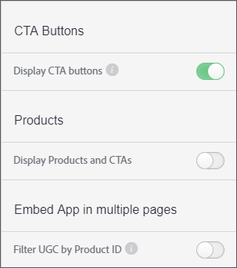

# Botão de chamada personalizada de chamada{#custom-call-to-action-button}

## Botão de chamada personalizada de chamada {#topic_EBE23A0F827645E0A0C619DCF3872EE5}

Os botões Chamada de ação personalizada (CTA) são botões que podem ser adicionados a qualquer ativo no Livefyre Studio para tornar o conteúdo acionável. Eles podem fazer referência a um usuário final a qualquer URL personalizado, como uma página de mídia social ou um carrinho de compras. Os botões CTA podem ser criados em vários locais no Livefyre, mas são gerenciados na **[!UICONTROL Settings]** seção do Livefyre Studio.

Com o ctas personalizado, você pode:

* Adicione botões CTA personalizados a qualquer parte de UGC em seus ambientes de mídia do Livefyre, mosaicos, carrosséis, faixas de filme e cartões de recursos individuais.
* Tenha controle sobre a mensagem, ícones, cores, links e número de botões em cada parte de UGC.
* Crie, gerencie e redirecione os botões CTA personalizados a partir de Configurações e da Biblioteca.
* Use o Adobe Analytics para medir as taxas de click-through.

## Criar um botão de chamada personalizada {#task_C61B4A8E66F24AC19C833612E596B736}

Contexto da tarefa

1. No Livefyre Studio, clique **[!UICONTROL Settings]**em.
1. No trilho à esquerda, clique **[!UICONTROL CTAs]**em.

   A biblioteca CTA será exibida, onde ctas podem ser criados e organizados dentro de pastas. 1. Clique **[!UICONTROL Create CTA]**em.
1. Preencha os campos com as personalizações desejadas e uma visualização de botão será renderizada na parte inferior da tela Criar CTA.

   

1. Clique **[!UICONTROL Create]**em.

   O botão CTA agora está disponível para ser adicionado a qualquer ativo.

## Adicionar um botão de ação personalizada a um ativo {#task_36190DD1C8204C7793CB7EEA379C2155}

Adicione um botão CTA a qualquer conteúdo no Livefyre Studio.

1. No Livefyre studio, navegue **[!UICONTROL Library]** até > **[!UICONTROL All Assets]**.
1. Selecione em um ou mais ativos para adicionar um botão CTA.
1. Clique **[!UICONTROL CTAs]**em.

   

1. Selecione o botão CTA desejado na lista e clique **[!UICONTROL Add]**em.

   O botão CTA agora aparecerá no ativo selecionado.

   >[!NOTE]
   >
   >Para que os ctas personalizados que você associe a cada ativo sejam exibidos em um aplicativo, ative os Botões CTA nas configurações do aplicativo:
   >
   >
