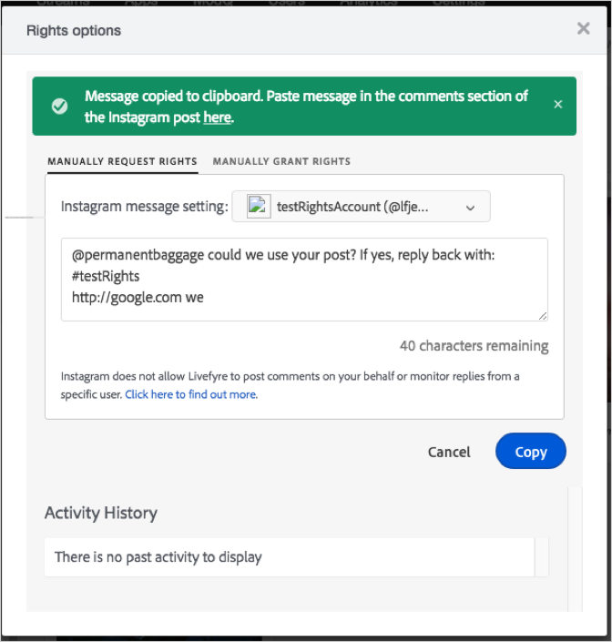

# Enviar uma solicitação de direitos do Instagram parcialmente automatizada{#send-a-partially-automated-instagram-rights-request}

Você pode solicitar o direito de reutilizar um ativo do Instagram obtido de uma pesquisa ou fluxo por autor (conta comercial) usando um fluxo de trabalho parcialmente automatizado.

Antes de enviar uma solicitação de direitos parcialmente automatizada, é necessário:

* Adicione uma conta de negócios do Instagram. Para obter mais informações sobre como configurar uma conta de negócios do Instagram, consulte [Sobre contas](../c-users-creating-accounts-with-studio-access/t-configure-social-accout-instagram/c-about-instagram-accounts.md#c_about_instagram_accounts)do Instagram.
* Configurar o Gerenciamento de direitos. Para obter mais informações sobre como configurar o gerenciamento de direitos, consulte [Solicitar direitos](../c-how-requesting-rights-works/c-how-requesting-rights-works.md#c_how_requesting_rights_works).

Para solicitar direitos do Instagram para uma pesquisa ou fluxo por autor de conta de negócios usando um fluxo de trabalho parcialmente automatizado:

1. Abra a **[!UICONTROL Rights options]** janela.
1. Selecione a conta a ser usada para solicitar direitos. A conta deve ser uma conta de negócios do Instagram.
1. (Opcional) Edite a mensagem de solicitação. Se a mensagem estiver sem um elemento ou um elemento obrigatório estiver com erro ortográfico, uma mensagem de erro será exibida que especifica as informações incorretas ou ausentes.
1. Clique **[!UICONTROL Copy]** em para copiar o texto na caixa para a área de transferência.

   

   O Livefyre copia automaticamente o texto da caixa para a área de transferência e exibe uma mensagem confirmando que o texto foi copiado.

1. Clique no link na mensagem de confirmação para abrir a publicação que contém o ativo ao qual você está solicitando direitos.

   

   O Livefyre abre a publicação no Instagram.

1. Cole o texto da solicitação copiada de direitos na postagem do Instagram no Instagram.
1. Quando o usuário responde, o Livefyre concede direitos ao pedaço de conteúdo no Livefyre.

O Livefyre acompanha quando você envia a solicitação de direitos, quando um usuário responde e quando os direitos de ativos são concedidos.
