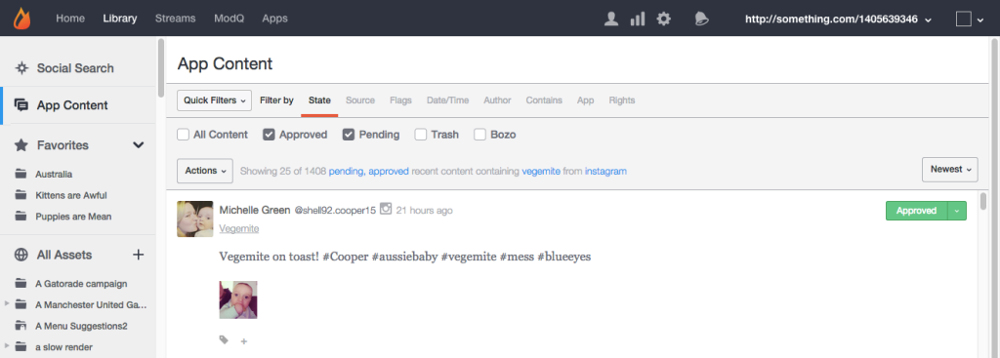

# Guia Conteúdo do aplicativo{#app-content-tab}

Gerenciamento de conteúdo na rede do Livefyre.

A guia Conteúdo do aplicativo na Biblioteca permite pesquisar e moderar conteúdo publicado em seus aplicativos. A **[!UICONTROL App Content]** guia permite vários filtros de pesquisa com pesquisa curinga para permitir que você defina de forma mais rápida e fácil seus parâmetros de pesquisa.

Use a guia Conteúdo do aplicativo para:

* Pesquisar conteúdo
* Exibir histórico de conteúdo
* Moderar conteúdo
* Adicionar uma tag
* Conteúdo do recurso
* Associar conteúdo a produtos do Catálogo de produtos

Para obter mais informações sobre como moderar o conteúdo usando a guia Conteúdo do aplicativo, consulte .

## Pesquisa de curinga {#section_jvr_ntm_zz}

Os campos de pesquisa do Livefyre suportam curingas, que permitem adicionar um asterisco (*) a palavras (ou fragmentos de palavras) para capturar correspondências parciais.

Por exemplo:

* bola retorna somente a bola
* ball * retorna bola e balão
* * ball retorna bola e futebol
* * ball * retorna bola e uniball e balanceado de neve

## Pesquisar conteúdo {#section_fw1_mtm_zz}

O painel Conteúdo do aplicativo permite restringir a pesquisa usando várias opções diferentes de filtragem de conteúdo.

Use o **[!UICONTROL Quick Filters]** pulldown para restringir o conteúdo retornado para **[!UICONTROL All Content]****[!UICONTROL All Sidenotes]****[!UICONTROL Approved]****[!UICONTROL Approved & Flagged]**, **[!UICONTROL Pending]**ou **[!UICONTROL Rights Requests]** status. Em seguida, selecione uma **[!UICONTROL Filter by]** opção e use as caixas de seleção ou campos de entrada disponíveis para restringir sua pesquisa.

Use o menu suspenso para classificar o conteúdo na lista por **[!UICONTROL Newest]****[!UICONTROL Oldest]**, **[!UICONTROL Recently updated]**ou **[!UICONTROL Most flags]****[!UICONTROL Most liked]**.

## Filtrar por opções {#section_aqn_xqm_zz}

Use **[!UICONTROL Filter by]** a barra para filtrar pelas seguintes opções:

* **Estado** Permite filtrar pelo estado atual de moderação do conteúdo: ** [!UICONTROL All Content]** **[!UICONTROL Approved]**, **[!UICONTROL Pending]**ou **[!UICONTROL Bozo]**.

* **Origem** Permite filtrar pela fonte do conteúdo. Selecione **[!UICONTROL Livefyre]** para listar o conteúdo gerado pelo usuário publicado diretamente no stream. Selecione **[!UICONTROL Facebook]**, **[!UICONTROL Twitter]**ou **[!UICONTROL RSS]** inclua conteúdo inserido em seus aplicativos a partir dessas fontes.

* **Sinalizadores** que selecionam Sinalizadores permitem filtrar por **[!UICONTROL User Flags]** (Spam, Desativado, Ofensivo ou Discordar) **[!UICONTROL System Flags]** , aplicado pela SAFE (Profanity, Spam ou Moderado magicamente) ou **[!UICONTROL Moderation Recommendations]**. 

* **Data/hora** Permite o fiter quando o conteúdo estava originalmente **[!UICONTROL Created]** (ou é colocado no aplicativo por meio do socialsync ou um Stream) ou pela última **[!UICONTROL Modified]** vez (editado, sinalizado ou o estado alterado).

* **Autor** Permite filtrar pelo **[!UICONTROL IP]** endereço do autor, **[!UICONTROL Display Name]** (encontrado no painel Usuários ou de cima do conteúdo postado pelo autor) ou **[!UICONTROL User ID]**(encontrado no painel Usuários).

* **Contém** permite filtrar os 90 dias mais recentes de conteúdo por **[!UICONTROL Keyword]** ou **[!UICONTROL Content Tag]**. Marque **[!UICONTROL Media]** a caixa de seleção para retornar somente o conteúdo que contém Mídia. (Para pesquisar todo o conteúdo, role para baixo todo o conteúdo da lista e clique **[!UICONTROL Search full data]**em.)

   **Observação:** Não há suporte para várias palavras-chave e pesquisa de tags de conteúdo. Se várias palavras-chave ou tags forem inseridas, a última palavra será usada para a pesquisa.

   Ao pesquisar por Tag de conteúdo, as tags sugeridas serão preenchidas automaticamente à medida que você digita no campo de pesquisa. Os resultados da pesquisa retornarão todo o conteúdo que recebeu a tag. (Use este campo para pesquisar conteúdo em destaque ou clique no **[!UICONTROL Featured]** rótulo em qualquer conteúdo em destaque no Studio.)

   **Observação:** Use um sinal de menos (-) antes de um nome de tag para pesquisar o conteúdo que não inclui essa tag. Por exemplo: Pesquise por '-Miley'para pesquisar por todo o conteúdo que não inclui a tag'Miley '.

* **Aplicativo** Permite filtrar por **[!UICONTROL Collection ID]**, **[!UICONTROL App Tag]**ou ID **pai**. A filtragem por ID pai retorna todo o conteúdo que é uma resposta à ID de conteúdo de entrada. (Filtrar por várias tags inserindo tags separadas por vírgula.)

* **Direitos** Permite filtrar por status de Solicitações de direitos: ** [!UICONTROL Requested]** **[!UICONTROL Granted]**, **[!UICONTROL Replied]**ou **[!UICONTROL Expired]**.

## Conteúdo Bozo {#section_afl_vqm_zz}

Em aplicativos, **[!UICONTROL Bozo]** o conteúdo é exibido somente para o autor do conteúdo. Isso permite que o usuário acredite que seu conteúdo foi aprovado, ao ocultá-lo a partir de todos os outros usuários e moderadores.

>[!NOTE]
>
>O conteúdo social originado com socialsync ou streams **[!UICONTROL cannot]** é definido como Bozo.

Você pode conteúdo Bozo pelos seguintes motivos:

* O conteúdo identificado como Spam por SAFE é automaticamente definido para o estado do Bozo.
* Todo o conteúdo de Usuários proibidos é definido automaticamente como Bozo.
* O conteúdo pode ser marcado como Bozo do Studio.
* Os moderadores podem conteúdo Bozo diretamente no stream.

## Exibir histórico de conteúdo {#section_ayz_tqm_zz}

O painel de conteúdo permite analisar o histórico de todo o conteúdo listado, incluindo a pré-moderação, a filtragem de spam, a data da publicação e qualquer sinalizador ou notas de usuário atribuídas ao item.

Use as guias na parte inferior do painel de conteúdo para visualizar seu histórico.

* **[!UICONTROL More Info:]** lista todas as atividades desse conteúdo, incluindo envio, edição, verificação de spam, alteração de estado e notas. A ID do conteúdo do Livefyre e o endereço IP do usuário também são exibidos nesta seção.
* **[!UICONTROL Replies:]** lista um máximo de 6 respostas. Clique **[!UICONTROL Show all replies]** em para exibir todas as respostas à publicação.

* **[!UICONTROL Flags & Reports:]** lista todos os sinalizadores de usuário, com o avatar do usuário que sinalizou o conteúdo e quaisquer Relatórios (notas adicionadas pelo usuário ao sinalizar o conteúdo).
* **[!UICONTROL Add a note:]** permite adicionar uma nota, visível para outros administradores ou moderadores.
* **[!UICONTROL Request Rights:]** abre a **[!UICONTROL New Rights Request]** caixa de diálogo, a partir da qual uma Solicitação de direitos pode ser emitida.

* ******[!UICONTROL Save as Asset:]abre a **[!UICONTROL Advanced Options]** caixa de diálogo, que permite salvar o item selecionado na Biblioteca de ativos, Publicar em um aplicativo ou solicitar direitos de reutilização do autor.

## Adicionar uma tag ao conteúdo {#section_xb4_mxr_rdb}

Marcar conteúdo permite categorizar e organizar o conteúdo para facilitar a recuperação e a personalização do estilo, ou marcar o conteúdo como destaque.

Para adicionar Tags, basta clicar no ícone de adição ( **[!UICONTROL +]**) sob conteúdo. Insira uma nova tag ou selecione-a de uma lista de tags existentes.

## Pesquisar imagens em todos os ativos {#section_zxf_hsf_wcb}

Após adicionar o conteúdo à biblioteca, você pode pesquisar o conteúdo por tags inteligentes.

Na Biblioteca, em Todos os ativos, você pode pesquisar imagens existentes clicando **[!UICONTROL Show Filters]** em e:

* Inserir texto para pesquisar no campo de pesquisa
* Classificação por relevância
* Inserir texto no **[!UICONTROL Tags]** campo para pesquisar por Tags inteligentes. O algoritmo de classificação Tags inteligentes filtra o conteúdo usando uma pontuação de confiança de tag inteligente, a novidade do conteúdo e quantas estrelas um usuário atribuiu ao conteúdo.

## Conteúdo em destaque {#section_emb_kqm_zz}

Selecione a tag padrão **[!UICONTROL Featured]** para marcar o conteúdo como destaque e realce-o como importante para os usuários. Depois de tags, use opções de estilo personalizadas para personalizar Conteúdo em destaque nos aplicativos.

## Como recurso ou conteúdo sem recursos {#section_ojx_3qm_zz}

* No Studio, clique no **[!UICONTROL +]** sinal ao lado de um conteúdo, selecione a **[!UICONTROL Featured]** tag na lista suspensa e clique **[!UICONTROL Enter]** em para conteúdo de recurso. A tag será salva e exibida ao lado do pedaço de conteúdo.

* Para cancelar o recurso, clique na **[!UICONTROL x]****[!UICONTROL Featured]** tag exibida na parte do conteúdo.

* Em um Comentário, Blog ativo ou Revisão, passe o mouse sobre o conteúdo que deseja adicionar e clique **[!UICONTROL Feature]**em. Para desfazer o recurso, passe o mouse sobre o conteúdo e clique **[!UICONTROL Unfeature]**em.

>[!NOTE]
>
>Devido a limitações de espaço, o conteúdo de bate-papo pode ser destacado ou não destacado usando o Studio e pode não ser destacado no próprio aplicativo.

## Editar conteúdo em destaque {#section_pyw_hqm_zz}

A maioria das ações regulares no conteúdo pode ser tomada em conteúdo em destaque, com exceção do seguinte:

* O conteúdo em destaque não pode ser sinalizado.
* Os usuários não poderão editar seu conteúdo após ele ter sido destacado, embora ainda possam excluí-lo se quiserem. Os moderadores podem editar conteúdo em destaque.

