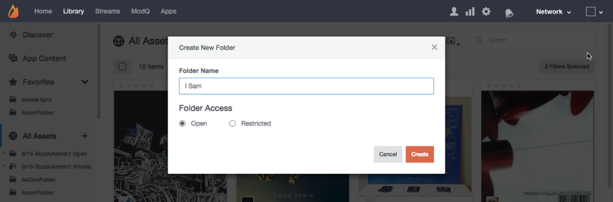

# Criar pastas de ativos{#create-asset-folders}

Crie pastas para organizar ativos.

A criação de uma nova pasta a adicionará à lista Todos os ativos em ordem alfabética. Para adicionar uma subpasta, primeiro selecione a pasta na qual ela estará localizada e clique no ícone **[!UICONTROL Create New Subfolder]** na parte superior da página.

1. Clique em **[!UICONTROL Create new folder]** na visualização de árvore, digite um nome e clique em **[!UICONTROL Create]** para criar a pasta no nível superior de Todos os ativos.
1. Selecione uma pasta e clique no ícone **[!UICONTROL Create New Subfolder]** na parte superior da página para adicionar uma subpasta.
1. Crie uma nova pasta ao adicionar conteúdo à Biblioteca de ativos a partir da caixa de diálogo **[!UICONTROL Add to folder > Select folder]**.
