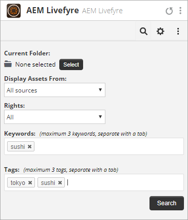

# Use o Adobe Experience Manager Livefyre com o Hootsuite{#use-adobe-experience-manager-livefyre-with-hootsuite}

Saiba como usar o Experience Manager Livefyre com o Hootsuite, permitindo preparar, gerenciar e compartilhar conteúdo gerado pelo usuário diretamente do painel do Hootsuite.

## Use o Adobe Experience Manager Livefyre com o Hootsuite {#topic_FB6E613DBCF74F39ABD5045C501EA326}

Saiba como usar o Experience Manager Livefyre com o Hootsuite, permitindo preparar, gerenciar e compartilhar conteúdo gerado pelo usuário diretamente do painel do Hootsuite.

## Introdução {#task_22699BD901C24384AB2DC02D926D8F4A}

Contexto da tarefa

1. Instale o Adobe Experience Manager Livefyre para Hootsuite no Diretório de Aplicativo Hootsuite.

1. No painel do Hootsuite, clique em **Fazer logon com Adobe**.

   

1. Faça logon no Experience Manager Livefyre usando suas credenciais do Livefyre.
1. Clique em **Autorizar** para conceder permissão de conjunto de hosts para acessar suas bibliotecas.

   

   Após conceder a permissão, você será redirecionado para o painel do Hootsuite, onde poderá pesquisar ativos nas bibliotecas do Experience Manager Livefyre.

## Pesquisar por ativos {#task_0B011B0C539E400BB72A6DF69FBF66C0}

Contexto da tarefa

1. Clique no ícone de pesquisa na barra de menus para procurar ativos nas bibliotecas do Experience Manager Livefyre.

   

1. Clique em **Selecionar** e um pop-up será exibido com todas as suas bibliotecas.
1. Clique na pasta de uma biblioteca e, em seguida, clique em **Selecionar pasta** para selecionar a biblioteca que será exibida no fluxo do conjunto de hosts.

   

## Opções de filtragem {#concept_5D062A9CD61A4B2E90784E5AA31CB16D}

Você pode filtrar os resultados da pesquisa usando as seções Exibir ativos de, Direitos, Palavras-chave e Tags .

As opções de filtragem incluem:

| Seção | Descrição |
|--- |--- |
| Exibir ativos de | Selecione para exibir ativos de Todas as fontes ou de uma fonte individual. Por exemplo: Instagram, Twitter, Facebook etc. |
| Direitos | Selecione para exibir apenas os ativos que têm uma configuração de direitos específica. |
| Palavras-chave | Selecione para filtrar os resultados por Palavras-chave ou Tags. A filtragem por palavras-chave pesquisará o conteúdo do texto de uma publicação, bem como o nome de exibição do autor e o nome de usuário do autor. |
| Tags | Selecione para filtrar os resultados por Palavras-chave ou Tags. A filtragem por palavras-chave pesquisará o conteúdo do texto de uma publicação, bem como o nome de exibição do autor e o nome de usuário do autor. |

Após selecionar os parâmetros de pesquisa, os ativos serão exibidos em fluxo ao pesquisar:

### Opções de menu de fluxo

Clicar no nome ou no ícone do usuário exibirá o usuário na respectiva rede. Clicar no horário exibirá o artigo original. Quando o mouse estiver sobre o item, mais opções serão exibidas. Clicar em Compartilhar 

ícone adicionará o ativo atual à caixa de composição de rede, permitindo compartilhá-lo com suas redes por meio do Hootsuite.

>[!NOTE]
>
>O botão compartilhar só aparecerá quando você estiver filtrando ativos com direitos concedidos.

Clique no ícone Atribuir  para atribuir o item atual a um dos membros da equipe do Conjunto de Hootsuite. Se um item já tiver sido atribuído, a opção Resolver 

será exibido. Clique para resolver a atribuição atual.

### Outros menus de aplicativo

Clicar nas Configurações 

ícone permitirá desconectar a conta Experience Manager Livefyre atual e conectar-se a outra.

Clicando no menu 

exibirá links para este documento, suporte e site do Synaptive.

## Plug-in do aplicativo Experience Manager Livefyre {#task_33C8CEF4F5E44830B970BB3A7AAA2AA6}

Além de poder exibir suas bibliotecas de ativos em um fluxo do Conjunto de hosts, você também pode salvar itens dos fluxos do Instagram, Twitter, Facebook e YouTube para suas bibliotecas do Experience Manager Livefyre.

1. Clique no ícone Menu localizado na parte inferior de cada item.

   

1. Selecione **Send to AEM Livefyre**.
1. Selecione uma ou mais bibliotecas para salvar o ativo.

   

1. Clique em **Salvar na biblioteca** e o item será salvo nas bibliotecas que você selecionou.

## Componente Experience Manager Livefyre Media Library {#task_9CA2D5D49F8E463F9EF475BC09C8ACC9}

Você pode acessar os ativos por meio dos Componentes de mídia do Hootsuite Composer.

1. No Composer, clique no link **Abrir Media Library** na seção **Media**.

   

1. Selecione Adobe Experience Manager Livefyre no menu suspenso e seus arquivos serão exibidos.

   

1. Para adicionar um ativo à publicação atual que você está escrevendo, clique nele. Para pesquisar um ativo específico, insira os termos de pesquisa na caixa **Pesquisar mídia** e os resultados serão exibidos.
