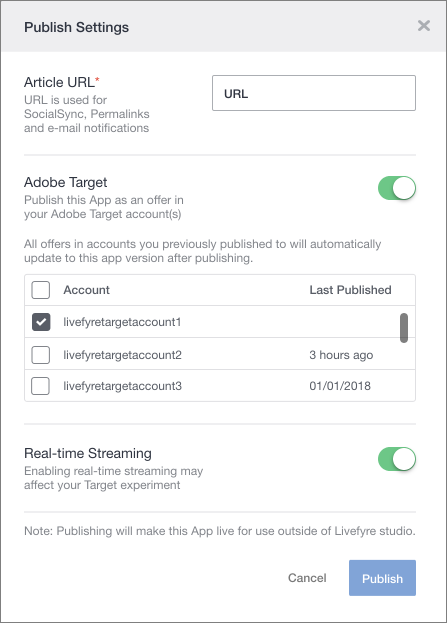

# Usar o Adobe Experience Manager Livefyre com o Adobe Target {#livefyre-target}

A integração do Livefyre com o Adobe Target permite compartilhar aplicativos do Livefyre diretamente na Biblioteca de ofertas do Target.

## Conecte uma instância do Livefyre com o Target {#connect-livefyre-target}

Conecte uma instância do Livefyre com o Adobe Target ao vincular sua conta do Adobe IMS nas configurações do usuário.

1. No Livefyre Studio, clique na **[!UICONTROL Users]** guia.

1. Selecione a conta de usuário que deseja conectar ao Target por meio da Integração de conta IMS.

1. Clique **[!UICONTROL Connect]**em.

1. Insira suas credenciais do IMS.

As instâncias do produto que sua conta do Adobe IMS têm acesso a serem exibidas na janela Integração do Adobe IMS.

Sua instância do Livefyre agora está conectada ao Adobe Target.

## Compartilhar um aplicativo do Livefyre com o Adobe Target {#share-livefyre-target}

Compartilhe um aplicativo criado no Livefyre Studio diretamente com o Adobe Target.

1. No Livefyre Studio, clique na **[!UICONTROL Apps]** guia.

1. Selecione o aplicativo que deseja compartilhar com o Adobe Target.

1. Clique **[!UICONTROL Publish]**em.

1. Nas Configurações de publicação, clique no botão Adobe Target.

Uma lista de Instâncias de meta é exibida.

1. Selecione a instância do Target na qual deseja compartilhar o aplicativo.

1. Clique **[!UICONTROL Publish]**em.

O aplicativo Livefyre agora está disponível para uso na Biblioteca de ofertas do Target. Para obter mais informações sobre a publicação de Aplicativos, consulte [Publicar conteúdo](/help/using/c-library/t-publish-content.md) e [ofertas](https://marketing.adobe.com/resources/help/en_US/target/target/c_manage_content.html) na documentação do Target.