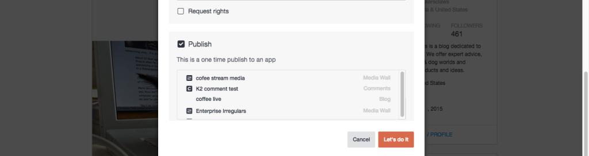

# Publicar conteúdo{#publish-content}

Publique conteúdo diretamente em um aplicativo.

O conteúdo publicado diretamente em um aplicativo não será salvo na Biblioteca de ativos.

1. **[!UICONTROL View Details]** para um ativo.
1. Selecione **[!UICONTROL Publish]** a caixa de seleção na caixa de **[!UICONTROL Advanced Options]** diálogo.
1. Selecione o aplicativo ao qual o item deve ser publicado.
1. Clique **[!UICONTROL Let’s do it]**em.
