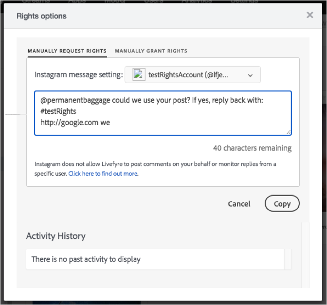

# 24 de maio de 2018{#may}

Notas de versão da versão de May 4 de maio de 24 18.

## Novos recursos

**Solicitações de direitos do Instagram, Atualizar parte 1.**

A capacidade de enviar solicitações de direitos no Instagram a partir do Livefyre não está disponível devido a uma alteração de API do Instagram. O Livefyre criou uma solução manual para os usuários enviarem solicitações de direitos. A capacidade de enviar manualmente solicitações de direitos usando este método pode ser encontrada no Conteúdo do aplicativo, a Biblioteca, mas não a modq (será entregue em uma versão futura):

1. Abra um ativo obtido de uma publicação do Instagram.
1. Abra a caixa de diálogo Solicitação de direitos.

   A caixa de diálogo é exibida com o texto da solicitação de direitos.

1. Clique no botão copiar para copiar o texto na caixa para a área de transferência.

   

   O Livefyre copia automaticamente o texto da caixa para a área de transferência e exibe uma mensagem confirmando que o texto foi copiado.

1. Clique no link na mensagem de confirmação para abrir a publicação que contém o ativo ao qual você está solicitando direitos.

   

   O Livefyre abre a publicação no Instagram.

1. Cole o texto da solicitação copiada de direitos na postagem do Instagram no Instagram.
1. Monitore a postagem da resposta.
1. Se o usuário do Instagram conceder direitos, você pode conceder os direitos manualmente no Livefyre.

>[!NOTE]
>
>Uma solução mais contínua (parte 2) será introduzida até 14 de junho de 24 18. Para obter mais, consulte [Anúncios](/help/using/c-anouncements.md#c_anouncements).

## Problemas

Os problemas nas tabelas a seguir foram resolvidos nesta versão.

## Versão de produção

| **Tipo de edição** | **Componente** | **Nota de versão** |
|---|---|---|
| Bug | Studio | Correção de um problema em que as atualizações nas apis do Facebook faziam com que algumas mídias fossem exibidas incorretamente. |

## Versão do UAT

Não há Notas de versão do UAT para esta versão.
