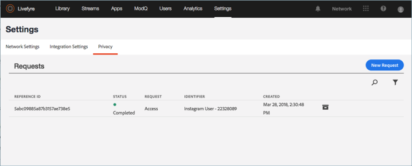
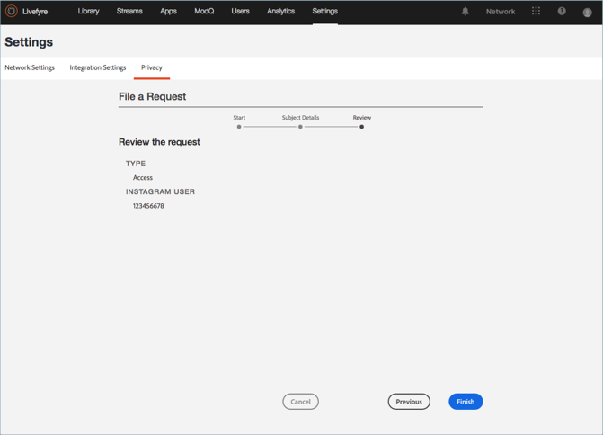

# Criar uma solicitação de privacidade{#create-a-privacy-request}

Crie uma solicitação de privacidade no Livefyre.

Exclua todos os dados de um usuário, gere um relatório de todos os dados para um usuário e faça alterações de aceitação ou cancelamento usando esse processo.

Para pesquisar e encontrar um usuário e gerar um relatório de seu conteúdo:

1. Vá para **[!UICONTROL Settings > Privacy]**e clique **[!UICONTROL Create Request]**em.

   

1. Preencha as informações na **[!UICONTROL Submit Request]** janela:

   * **[!UICONTROL Reference Id]**. Digite um identificador para usar para referência futura. Por exemplo, é possível adicionar texto, um número de ticket, um URL, um endereço de email ou outra cadeia de caracteres de até 255 caracteres
   * **[!UICONTROL Type]**

      * **Acesso**. Coleta todos os dados disponíveis associados à conta. Detalhes confidenciais, por exemplo, senhas ou credenciais sociais, serão ofuscados ou omitidos.

      * **Excluir**. Celianas ou ofuscam todos os dados associados à conta. **Se escolher essa opção e clicar em Enviar, não será possível reverter ou cancelar essa ação, *nem recuperar os dados excluídos.*** Se a conta pertencer a um usuário do Livefyre Studio, alguns dados serão preservados para manter a integridade dos registros de negócios.

         >[!IMPORTANT]
         >
         >A exclusão de dados de uma conta excluirá ou destruirá permanentemente os dados associados à conta. Não é possível reverter essa ação, nem recuperar os dados depois que você o excluiu.

      * **Recusar**. Impede o Livefyre de coletar dados ou conteúdo de uma conta social por meio de fluxos ou pesquisa social. Opt-in e opt-out não se aplicam a usuários registrados
      * **Aceitação**. Habilite novamente o Livefyre para coletar dados ou conteúdos de uma conta social que anteriormente optava por Streams ou Pesquisa Social. Opt-in e opt-out não se aplicam a usuários registrados
      

   * **[!UICONTROL Identifier Type]** e **[!UICONTROL Identifier]**

      * **[!UICONTROL User Account]**

         * Identifica uma conta de um usuário registrado pela ID da conta de usuário gerada pelo identificador do usuário do Livefyre ou do Livefyre do Livefyre. Você também pode localizar a ID da conta de usuário em Detalhes do usuário para o usuário nas **Configurações** **do usuário do Livefyre** ou nos detalhes do conteúdo na Biblioteca **de ativos** ou no Conteúdo **do aplicativo**

         * Valores permitidos: Sequência alfanumérica de até 255 caracteres. Um endereço de email não é uma entrada válida
      * **[!UICONTROL Facebook User]**

         * Identifica uma conta por uma ID numérica fornecida pelo Facebook. O solicitante deve fornecer isso. Você pode encontrar instruções sobre como localizar a ID numérica do Facebook [aqui](https://www.facebook.com/help/1397933243846983?helpref=faq_content)
         * Valores permitidos: 6-16 caracteres numéricos
      * **[!UICONTROL Instagram User]**

         * Identifica a conta por uma ID numérica fornecida pelo Instagram. O solicitante deve fornecer isso. Você pode encontrar instruções sobre como localizar a ID numérica do Instagram em uma conta do Instagram pesquisando online
         * Valores permitidos: 5-16 caracteres numéricos
      * **[!UICONTROL Twitter User]**

         * Identifica uma conta por uma ID numérica fornecida pelo Twitter. A pessoa que solicita a mudança de privacidade deve fornecer isso. Você pode encontrar instruções sobre como localizar a ID numérica do Twitter de uma conta do Twitter pesquisando online
         * Valores permitidos: 5-16 caracteres numéricos
      * **[!UICONTROL YouTube User]**

         * Identifica uma conta por uma ID numérica fornecida pelo youtube. A pessoa que solicita a mudança de privacidade deve fornecer isso. Você pode encontrar instruções sobre como localizar a ID numérica do youtube em uma conta do youtube [aqui](https://support.google.com/youtube/answer/3250431?hl=en)
         * Valores permitidos: 5-16 caracteres numéricos
      * **[!UICONTROL Generic Author]**

         * Identifica uma conta por uma ID do autor do Livefyre (JID). Use esta opção para o conteúdo gerado por meio de RSS, Tumblr ou urls. Para encontrar essa ID, procure o conteúdo atribuído ao Autor no Conteúdo **do Aplicativo** ou **na Biblioteca**de Ativos e selecione um item. The ID is available in **App Content** under **Info** or in the **Asset Library** under **Author** in the **Details** section

         * Valores permitidos: Sequência alfanumérica de até 255 caracteres
         

1. Clique **[!UICONTROL Finish]**em.

   

1. (Somente para exclusão de solicitações) Confirme se deseja excluir todas as informações para o usuário.

   >[!IMPORTANT]
   >
   >A exclusão de dados de uma conta excluirá ou destruirá permanentemente os dados associados à conta. Não é possível reverter essa ação, nem recuperar os dados depois que você o excluiu.

