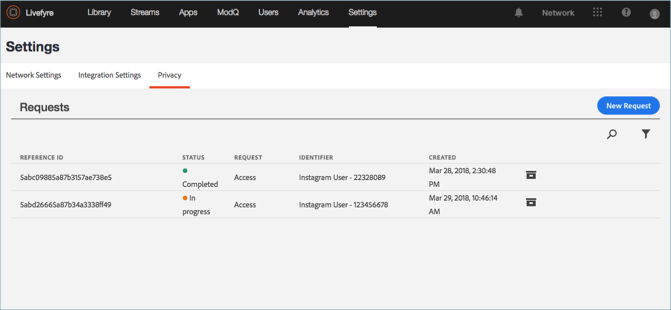

# Exibir um Relatório de Privacidade{#view-a-privacy-report}

Visualize um relatório de privacidade no Livefyre para ver quais informações são gravadas no Livefyre para um usuário.

1. Ir para **[!UICONTROL Settings > Privacy]**.
1. Clique em um relatório de privacidade na lista para visualizá-lo.

