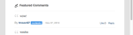
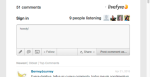

# Localize sequências de caracteres{#localize-strings}

Personalização das cadeias de caracteres dos aplicativos Livefyre.

As cadeias de caracteres de texto para a maioria dos elementos HTML em qualquer aplicativo Livefyre podem ser personalizadas. Isso proporciona a flexibilidade para alterar o texto de elementos HTML renderizados, como o botão &quot;Postar como&quot;, o texto &quot;Contagem de comentários&quot; ou o botão &quot;Conectar&quot;, para qualquer string UTF-8 válida. Use esse recurso para adicionar personalidade à sua implementação do fluxo ou para localizar o idioma no aplicativo para sua base de usuários.

* Comentários, Bate-papo e Blog ao vivo

   * [Implementação](#c-localize-strings/section_im4_224_xz)
   * [Acesso à conta](#c-localize-strings/section_cm3_d24_xz)
   * [Informações de fluxo](#c-localize-strings/section_wx1_c24_xz)
   * [Classificação de fluxo](#c-localize-strings/section_ih2_124_xz)
   * [Informações de conteúdo](#c-localize-strings/section_llv_yd4_xz)
   * [Conteúdo em destaque](#c-localize-strings/section_gmw_vd4_xz)
   * [Editor de texto](#c-localize-strings/section_ky5_td4_xz)
   * [Opções de resposta](#c-localize-strings/section_zvt_qd4_xz)
   * [Notificador de comentários](#c-localize-strings/section_qqt_pd4_xz)
   * [Mensagens de erro](#c-localize-strings/section_omz_jxn_xz)

* [Formato de data e hora](#c-localize-strings/section_yz4_g5n_xz)
* [Mural de mídia](#c-localize-strings/section_vwt_d5n_xz)
* [Mapa](#c-localize-strings/section_fxv_c5n_xz)
* [Mosaico](#c-localize-strings/section_e2s_b5n_xz)
* [Carrossel](#c-localize-strings/section_l2z_hkn_xz)
* [Placa de recurso](#c-localize-strings/section_mw2_hkn_xz)
* [Pesquisa](#c-localize-strings/section_pdg_fwh_xz)
* [Identidade do Livefyre](#c-localize-strings/section_zc3_xvh_xz)
* Mais:
   * [Rever cadeias de texto](/help/using/c-settings-other/c-translation-sets/c-review-text-strings.md#c_review_text_strings)
   * [Observações](/help/using/c-settings-other/c-translation-sets/c-sidenotes-text-strings.md#c_sidenotes_text_strings)

## Implementação {#section_im4_224_xz}

Para implementar esse recurso, passe um mapeamento de objeto 1-1 das cadeias de caracteres que deseja substituir no objeto de configuração JavaScript. Se um campo não for fornecido, o texto padrão será usado.

Exemplo:

```
var customStrings = {     
   postAsButton: "New Post As Text",     
   postEditButton: "New Post Edit Text"  
};   
   convConfig["strings"] = customStrings; fyre.conv.load(     
   networkConfig,     
   [convConfig],     
   function(){}  
);
```

Esta página lista todas as sequências de texto que podem ser personalizadas para os aplicativos principais do Livefyre.

## Acesso à conta {#section_cm3_d24_xz}

Strings disponíveis para o processo de autenticação e nos menus de usuário autenticado.


| Elemento | Chave | Texto padrão |
|---|---|---|
|  | displayName | %s |
|  | editProfile | Editar perfil |
|  | notificationSettings | Configurações de notificação |
|  | siteAdmin | Admin Console (links para o Studio) |
|  | signOut | Fazer logoff |

## Informações de fluxo {#section_wx1_c24_xz}

Strings disponíveis para informações e exibição do fluxo de conteúdo. Lista o número de pessoas que estão ouvindo, o número de publicações no aplicativo e permite que os usuários façam logon ou acessem suas informações de conta.

| Chave | Texto padrão | Dados de fluxo |
|---|---|---|
|  | commentCountLabelZero | Comentário %s |
|  | commentCountLabel | Comentário %s |
|  | commentCountLabelPlural | %s comentários |
|  | listenerCount | escuta de pessoa |
|  | listenerCountPlural | pessoas ouvindo |
|  | liveblogPostCountLabelZero | postar |
|  | liveblogPostCountLabel | postar |
|  | liveblogPostCountLabelPlural | posts |
| Opções de thread | threadBreakoutButton | Mostrar todo o Thread |
|  | alternarRecolher | Alternar Recolher |
| Alta velocidade / comentários na fila | atualizar | Atualizar |
|  | newComment | Novo comentário |
|  | newComments | Novos comentários |
|  | newReply | nova resposta |
|  | newReplies | novas respostas |

## Classificação de fluxo {#section_ih2_124_xz}

Permite que os usuários classifiquem o conteúdo retornado por idade ou popularidade.


| Chave | Texto padrão | Opções de cabeçalho |
|---|---|---|
|  | sortNewest | Mais recente |
|  | sortOldest | Mais antiga |
|  | sortTopComments | Principais comentários |
|  | sortHotThreads | Threads principais |
|  | sortSeparator |  |  |
|  | streamSorting | Carregando |
|  | topCommentsContentNotFoundMsg | Ainda não há curtidas suficientes. |
|  | hotThreadsContentNotFoundMsg | Ainda não há threads suficientes. |
|  | streamRefreshMsg | Veja as novidades. |
| Opções de rodapé | archiveHeaderTitle | Do Arquivo |
|  | archiveShowMore | Mostrar mais |
|  | showMore | Mostrar mais comentários |
|  | showMoreLiveblog | Mostrar mais publicações |


## Informações de conteúdo {#section_llv_yd4_xz}

Lista as informações da publicação: nome de usuário, quaisquer tags de usuário aplicadas e tempo de postagem.

  

| Chave | Texto padrão | Autor |
|---|---|---|
|  | moderador | moderador |
|  | hovercardViewProfile | Exibir perfil completo |
| Informações da publicação | timeJustNow | agora mesmo |
|  | timeMinutesAgo | minuto atrás |
|  | timeMinutesAgoPlural | minutos atrás |
|  | timeHoursAgo | hora atrás |
|  | timeHoursAgoPlural | horas atrás |
|  | timeDaysAgo | dia atrás |
|  | timeDaysAgoPlural | dias atrás |
|  | LikePlural | Curtidas |
|  | LikeSingular | Curtir |
|  | moderatorEditTimestamp | Editado por um moderador |
|  | commentTombstone | Este comentário foi excluído |
|  | permalinkNotFoundMsg | Este comentário não está mais visível. |
|  | quickProfileTooltip | Perfil rápido |

## Conteúdo em destaque {#section_gmw_vd4_xz}

Se ativado, o conteúdo em destaque é listado na parte superior do fluxo.

|  | Chave | Texto padrão |
|---|---|---|
| Etiquetas em destaque |  |  |
|  | featuredCommentsTag | Em destaque |
|  | featuredCommentsTitlePlural | Comentários em destaque |

## Editor de texto {#section_ky5_td4_xz}

Por padrão, disponível na parte superior da página para todos os usuários.



|  | Chave | Texto padrão |
|---|---|---| 
| Botões Editor | seguir | + Seguir |
|  | seguir | - Não seguir |
|  | liveblogFollow | Seguir Blog Ao Vivo |
|  | liveblogUnfollow | Ignorar Blog Ao Vivo |
|  | postButton(Disponível para usuários conectados). | Comentário da postagem |
|  | postAsButton(Disponível para usuários não autenticados.) | Publicar comentário como... |
|  | postEditButton | Editar comentário |
|  | postEditAsButton | Editar comentário como... |
|  | postEditCancelButton | Cancelar |
|  | editorDisabled | Esta conversa está atualmente fechada para novos comentários. |
| Opções de bate-papo | livechatPostButtonLabel | Publicar |
|  | livechatPostEditButton | Editar   |
|  | livechatWindowsInstruction | Pressione Ctrl+Enter para postar |
|  | livechatOtherInstruction | Pressione command+enter para postar |

## Opções de resposta {#section_zvt_qd4_xz}

Salvo indicação em contrário, disponível para todos os usuários conectados. Passe o mouse sobre um painel de conteúdo para acessá-lo.


| Chave | Texto padrão |  |
|---|---|---|
| Opções de resposta do usuário | Disponível para usuários finais. |  |
| flagButton | Segnalato |
|  | flagCommentTooltip | Segnalato |
|  | editButton(Disponível somente para autores e moderadores, se ativado). | Editar   |
|  | deleteButton(Disponível somente para autores e moderadores, se estiver habilitado.) | Excluir |
|  | deleteCommentTooltip | Excluir |
|  | shareButton | Compartilhar |
|  | shareCommentTooltip | Compartilhar |
|  | likeButton | Curtir |
|  | unlikeButton | Curtir (desfazer) |
|  | replyButton | Responder |
|  | replyButtonSingular(Disponível para Chat e Blog em tempo real). | Responder |
|  | replyButtonPlural(Disponível para Chat e Blog em tempo real). | Respostas |


| Chave | Texto padrão |  |
|---|---|---|
| Sinalizador Modal | flagTitle | Sinalizar comentário de %s |
|  | flagSubtitle | Sinalizar como |
|  | flagDefaultSelectOption | Selecionar |
|  | flagSpam | Spam |
|  | flagSpamButton | Spam |
|  | flagSpamCommentTooltip | Spam |
|  | flagOffensive | Ofensiva |
|  | flagOffensiveButton | Ofensiva |
|  | flagOffensiveCommentTooltip | Ofensiva |
|  | flagDisagree | Discordo |
|  | flagDisagreeButton | Discordo |
|  | flagDisagreeCommentTooltip | Discordo |
|  | flagOffTopic | Tópico desativado |
|  | flagOfftopicButton | Tópico desativado |
|  | flagOfftopicCommentTooltip | Tópico desativado |
|  | flagEmail | Email |
|  | flagEmailPlaceholder | you@example.com |
|  | flagNotes | Notas |
|  | flagNotesPlaceholder | Comece digitando aqui... |
|  | flagConfirmButton | OK |
|  | flagCancelButton | Cancelar |
|  | flagConfirmationMessage | Sinalizar o comentário de %s como %s? |
|  | flagSuccessMsg | O comentário foi sinalizado. |


| Chave | Texto padrão |  |
|---|---|---|
| Compartilhar modal | shareTitle | Comentário do Compartilhamento |
|  | sharePlaceholderText | O que você acha? |
|  | shareLabel | Compartilhar em: |
|  | shareTextTwitter | em branco |
|  | shareTextFacebook | em branco |
|  | shareTextLinkedin | em branco |
|  | shareButtonText | Compartilhar |
|  | sharePermalink | Permalink |
|  | loadingPermalink | Carregando url curto... |
|  | shareText | Acabei de postar um comentário. Dê uma olhada! |


| Chave | Texto padrão |  |
|---|---|---|
| Responder Modal | postReplyAsButton | Publicar comentário como... |
|  | postReplyButton(Disponível para usuários conectados). | Comentário da postagem |
|  | backToHotThreads | Voltar para Threads Hot |


| Chave | Texto padrão |  |
|---|---|---|
| modal @menção do twitter | mentionTitle | Compartilhar menção |
|  | mentionSubtitleTwitter | Compartilhar tweet em: |
|  | mentionDefaultText | Eu mencionei você em um comentário da Livefyre! |
|  | mentionConfirmButton | OK |
|  | mentionCancelButton | Cancelar |
|  | mentionErrorGeneral | Opa! Algo deu errado! Livefyre foi alertado. |
|  | mentionErrorNoneSeleted | Você deve ter pelo menos uma menção ativada. |
|  | mentionMenuTitle | Para ver e mencionar seus amigos |
|  | mentionTwitterConnect | Conectar-se ao Twitter |
|  | mentionTwitterFetching | Buscando Amigos... |
|  | mentionSuccessMsg | As menções foram enviadas com êxito. |


| Chave | Texto padrão |  |
|---|---|---|
| Editar modal | Disponível para Studio Admins, User Managers ou Moderators |  |
| @(@mention.) | &lt;/>(Abre a janela html personalizada.) |  |
|  | customHtmlDialogTitle(Aparece como o cabeçalho da modal.) | Adicionar HTML personalizado |


| Chave | Texto padrão |  |
|---|---|---|
| Opções de resposta do moderador | Disponível para Studio Admins, User Managers ou Moderators. |  |
| pendingComment | pendente |
|  | banUserButton | Usuário da proibição |
|  | banUserTooltip | Utilizador de Interdição |
|  | bozoButton | Bozo |
|  | bozoCommentTooltip | Bozo |
|  | featureButton | Recurso |
|  | featureCommentTooltip | Recurso |
|  | unfeatureButton | Desrecurso |
|  | featuredCommentTooltip | Desrecurso |


| Chave | Texto padrão |  |
|---|---|---|
| Modal de Usuário de Proibição | Disponível para Studio Admins, User Managers ou Moderators. |  |
| banTitle | Utilizador de Interdição |  |
|  | banConfirmation | Tem certeza de que deseja proibir este usuário? |
|  | banConfirmButton | OK |
|  | banCancelButton | Cancelar |

## Notificador de comentários {#section_qqt_pd4_xz}

Se estiver habilitado, disponível na parte inferior da página para todos os aplicativos Livefyre Conversation.


|  | Chave | Texto padrão |
|---|---|---|
| Rótulos do notificador | commentNotifier | Novo comentário |
|  | commentNotifierPlural | Novos comentários |
|  | liveblogNotifier | Nova postagem |
|  | liveblogNotifierPlural | Novas postagens |

## Mensagens de erro {#section_omz_jxn_xz}

Cadeias de caracteres disponíveis para mensagens de erro personalizáveis.

| Chave | Texto padrão |
|---|---|
| errorAuthError | Você não está autorizado a postar um comentário nesta conversa |
| errorCommentsNotAllowed | Comentários não são permitidos nesta conversa |
| errorDefault | Ocorreu um erro. Tente novamente. |
| errorDuplicate | Por mais que tenha gostado do seu comentário, você não tem permissão para postá-lo duas vezes. |
| errorEditDuplicate | Você deve alterar o corpo do comentário ao editá-lo. |
| errorEditNotAllowed | Você não tem permissão para editar comentários nesta conversa. |
| errorEditTimeExceeded | Seu período de edição de comentários expirou. |
| errorEmpty | Parece que você está tentando postar um comentário vazio. |
| errorExpirou | Sua sessão expirou. Recarregue a página. |
| errorFlagNotSeleted | Selecione um tipo de sinalizador. |
| errorGuestLiked | Desculpe, somente aqueles com contas podem gostar de conteúdo. |
| errorInsuficientesPermissions | Permissões insuficientes |
| errorInvalidChar | Parece que você está tentando postar um caractere inválido. |
| errorLikeOwnComment | Você não pode curtir seu próprio comentário |
| errorMalformation | Parece que você está tentando publicar conteúdo malformado. |
| errorMaxChars | Desculpe, seu comentário é muito longo. Edite e tente novamente. |
| errorMediaNotAvailable | A mídia não está mais visível. |
| errorShowMore | Erro ao carregar mais comentários. |
| MultipleMediaNotAllowedError | Suas permissões só concedem um anexo de mídia de cada vez. |

## Formato de data e hora {#section_yz4_g5n_xz}

Traduza e personalize a forma como as datas são exibidas em cartões de conteúdo em aplicativos de visualização.

| Chave | Texto padrão |
|---|---|
| hoursAgo | {número}h |
| hoursAgoSingular | {número}h |
| justNow | 1s |
| minutesAgo | {número} m |
| minutesAgoSingular | {número} m |
| monthDayFormat | {day} {monthAbbrev} |
| monthDayYearFormat | {day} {monthAbbrev} {year} |
| monthNames | Janeiro, Fevereiro, Março, Abril, Maio, Junho, Julho, Agosto, Setembro, Outubro, Novembro, Dezembro |
| monthNamesAbbrev | Jan, Fev, Mar, Abr, Maio, Junho, Jul, Ago, Set, Out, Nov, Dez |
| secondsAgo | {número} s |
| secondsAgoSingular | {número} s |

## Mural de mídia {#section_vwt_d5n_xz}

Cadeias de caracteres disponíveis para o aplicativo Media Wall.

| Chave | Texto padrão |
|---|---|
| featuredText | Em destaque |
| shareButtonText | Compartilhar |

| Chave | Texto padrão |
|---|---|
| postButtonText | O que você acha? |
| postModalTitle | Publicar seu comentário |
| postModalButton | Publicar seu comentário |
| postModalPlaceholder | O que você gostaria de dizer? |
| showMoreButtonText | Carregar mais |
| shareButtonText | Compartilhar |

## Mapa {#section_fxv_c5n_xz}

Strings disponíveis para Mapas.

| Chave | Texto padrão |
|---|---|
| featuredText | Em destaque |
| shareButtonText | Compartilhar |

## Mosaic {#section_e2s_b5n_xz}

Cadeias de caracteres disponíveis para Mosaics.

| Chave | Texto padrão |
|---|---|
| featuredText | Em destaque |
| shareButtonText | Compartilhar |

## Carrossel {#section_l2z_hkn_xz}

Strings disponíveis para Carrossel.

| Chave | Texto padrão |
|---|---|
| featuredText | Em destaque |
| shareButtonText | Compartilhar |

## Placa de recurso {#section_mw2_hkn_xz}

Cadeias de caracteres disponíveis para a placa de recurso.

| Chave | Texto padrão |
|---|---|
| featuredText | Em destaque |
| shareButtonText | Compartilhar |

## Fazer upload do aplicativo {#section_grc_gkn_xz}

Cadeias de caracteres disponíveis para o aplicativo de upload.

| Chave | Texto padrão |
|---|---|
| postButtonText | O que você acha? |
| postModalTitle | Publicar seu comentário |
| postModalButton | Publicar seu comentário |
| postModalTitlePlaceholder | Inserir um título |
| postModalPlaceholder | O que você gostaria de dizer? |
| postModalConfirationTitle | Obrigado por postar! |
| postModalConfirmationMessage | Seu post está sendo revisado. |
| postModalConfirmationButton | Concluído |
| title |  |
| message |  |
| editorErrorAttachmentsRequired | É necessário um anexo |
| editorErrorBody | Adicione uma mensagem |
| editorErrorDuplicate | Por muito que goste da sua nota, não pode publicá-la duas vezes |
| editorErrorGeneric | Houve um erro |
| editorErrorTitleRequired | É necessário um título |

## Pesquisa {#section_pdg_fwh_xz}

Cadeias de caracteres disponíveis para pesquisas.

| Chave | Texto padrão |
|---|---|
| totalVotesLabel | %s votos totais |
| shareStringText | Acabei de votar em %s qual é o seu voto? |
| pollClosedLabel | Esta pesquisa está atualmente fechada |

## Identidade do Livefyre {#section_zc3_xvh_xz}

Cadeias de caracteres disponíveis para o Livefyre Identity.

| Chave | Texto padrão |
|--- |--- |
| automaticallyFollowConversations | Acompanhar automaticamente as conversas nas quais me associo |
| back | Voltar |
| bio | Biografia |
| criar | Criar  |
| createANewAccount | Criar nova conta |
| createNewAccountWithEmail | Criar uma nova conta com email |
| changeAvatar | Alterar Avatar |
| chooseFile | Selecionar arquivo |
| completeAccount | Conta completa |
| emailQuandoAlguémResponde | Enviar e-mail quando alguém me responder |
| emailCommentsIFollow | Enviar comentários por e-mail em conversas que seguir |
| emailSenttoResetPassword | Email enviado! Verifique se há um link na caixa de entrada para redefinir a senha |
| emailverifySent | Verificação de email enviada |
| firstName | Nome |
| EsqueciSenha | Esqueceu a senha? |
| EsqueceuSuaSenha | Esqueceu sua senha? |
| EsqueceuSuasInstruçõesDeSenha | Insira seu nome de usuário ou endereço de email abaixo e enviaremos um link para alterar sua senha. |
| formInputCloseButtonText | Close |
| formInputCancelButtonText | Cancelar |
| formInputSaveButtonText | Salvar |
| hasNotLeftAnyComments | não deixou nenhum comentário |
| locationIsFrom | é de |
| labelAvatar | Avatar |
| labelComments | Comentários |
| labelConfirmNewPassword | Confirmar nova senha |
| labelConfirmPassword | Confirmar senha |
| labelEmail | Email Address |
| labelLikes | Curtidas |
| labelLoading | Carregando |
| labelNewPassword | Nova senha |
| labelNotification | Notificações |
| labelPassword | Senha |
| labelProfile | Perfil |
| labelUsername | Nome de usuário |
| labelUsernameOrEmail | Nome de usuário ou email |
| lastName | Sobrenome |
| livefyreAccount | Conta Livefyre |
| localização | Localização |
| loadingProfile | Carregar perfil |
| newPassword | Nova senha |
| oldPassword | Senha antiga |
| on | on |
| ou | ou |
| passwordLinkExpirou | O link que você clicou para redefinir sua senha expirou. Redefina sua senha novamente e lhe enviaremos um novo link. |
| Por favor, verifiqueEmailToComplete | Verifique seu email para concluir seu registro. |
| postado | Postado |
| powerby | alimentado por |
| profileNotificationImmediate | immediate |
| profileNotificationHhour | por hora |
| profileNotificationNever | never |
| recentComments | Comentários recentes |
| redefinir | Reset |
| resetPassword | Redefinir senha |
| signIn | Conectar |
| signInWith | Fazer logon com |
| signInWithEmail | Fazer logon com email |
| signUp | Inscrever-se |
| socialAccount | Conta do Social |
| successPasswordChanged | Sucesso! Sua senha foi alterada e você está conectado |
| termsAndConditions | Termos e condições |
| termsAndConditionsIntro | Ao se inscrever, você aceita a variável |
| termsOfUse | Termos de uso |
| termsOfUseIntro | Ao fazer logon, você concorda em |
| thisUser | Este usuário |
| verifyPassword | Verificar senha |
| fileSizeLimit | 2 MB máx. |
| accountnotfound | Conta não encontrada |
| avatarImageExceedSize | Sua imagem de avatar excedeu o limite de arquivos de 2mb |
| fieldisrequired | O campo aceita apenas um inteiro |
| fieldonlyaceittsavalidemail | O campo aceita apenas um email válido |
| fieldonlyaceittsletters | O campo só aceita letras |
| filesizemustbelessthanMB | O tamanho do arquivo deve ser menor que {#}MB |
| invalidusernameorpassword | Nome de usuário ou senha inválido |
| minimumlength thofcaracteres | Comprimento mínimo de {#} caracteres |
| comprimento máximo de caracteres | Tamanho máximo de {#} caracteres |
| rewasanerror | Houve um erro |
| este fieldisrequired | Esse campo é obrigatório. |
| validfileextensions | Extensões de arquivo válidas |
| valuemustmatch | O valor deve corresponder |
| passwordLength | ter entre 6 e 32 caracteres. |
| passwordCharacters | incluem caracteres em letras minúsculas e maiúsculas. |
| passwordSymbols | incluir pelo menos um número e um símbolo. |
| passwordUsername | não contém seu nome de usuário. |
| passwordPopoverTitle | Sua senha precisa: |
| passwordErrorContainsFirstName | A senha digitada contém o nome de usuário, nome ou sobrenome. Por motivos de segurança, insira uma senha que não contenha seu nome de usuário, nome ou sobrenome. Lembre-se também de que sua senha precisa conter: 6 a 32 caracteres Um caractere maiúsculo Um caractere minúsculo Um símbolo de letra A |
| passwordErrorContainsLastName | A senha digitada contém o nome de usuário, nome ou sobrenome. Por motivos de segurança, insira uma senha que não contenha seu nome de usuário, nome ou sobrenome. Lembre-se também de que sua senha precisa conter: 6 a 32 caracteres Um caractere maiúsculo Um caractere minúsculo Um símbolo de letra A |
| passwordErrorContainsUsername | A senha digitada contém o nome de usuário, nome ou sobrenome. Por motivos de segurança, insira uma senha que não contenha seu nome de usuário, nome ou sobrenome. Lembre-se também de que sua senha precisa conter: 6 a 32 caracteres Um caractere maiúsculo Um caractere minúsculo Um símbolo de letra A |
| passwordErrorTooShort | Mínimo de 6 caracteres para senha |
| passwordErrorTooLong | Máximo de 32 caracteres para senha |
| passwordErrorMissingUppercase | A senha deve conter pelo menos um caractere maiúsculo |
| passwordErrorMissingLowercase | A senha deve conter pelo menos um caractere em letras minúsculas |
| passwordErrorMissingSymbol | A senha deve conter pelo menos um símbolo no conjunto `!@#$%^&*()?.,<>\’;:”[]{}|` |
