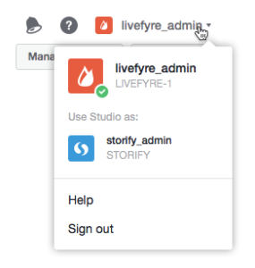

# Usuários Alternando Redes{#users-switching-networks}

Você pode gerenciar várias redes de uma única conta do Studio.

>[!NOTE]
>
>Isso não é comum.

O menu suspenso **[!UICONTROL Account]** lista todos os nomes de usuário associados à conta do Studio na qual você está conectado no momento e as redes às quais eles estão associados. Use esse menu suspenso para selecionar a rede que deseja gerenciar.

>[!NOTE]
>
>Embora a maioria dos usuários tenha permissões somente para uma única rede, alguns usuários do Studio podem ter ou moderar vários sites. A conta do Studio permite que eles façam logon com um único nome de usuário e senha e, em seguida, alternem entre vários níveis de acesso ao site.

