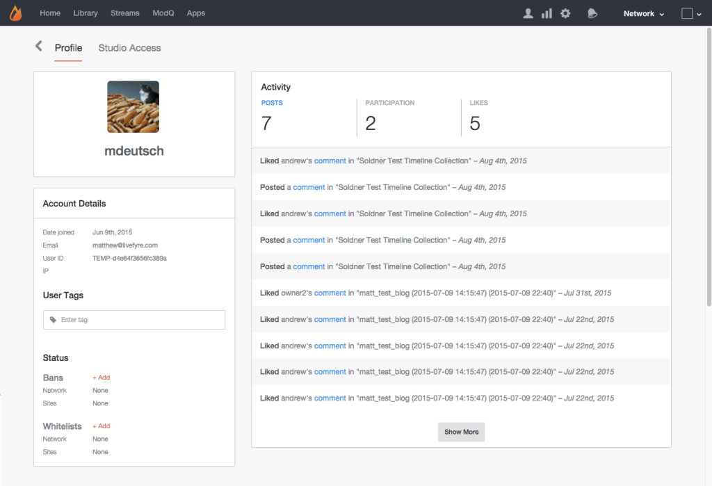

# Visualizando detalhes da conta{#viewing-account-details}

Clique em qualquer usuário para exibir detalhes sobre a conta.

## Perfil {#section_mpn_ttp_vz}

A página Perfil fornece informações da conta do usuário, incluindo a data em que a conta foi criada, a ID de usuário e o endereço de email associado a ela, uma lista de todas as atividades do usuário da conta e uma lista de quaisquer Tags, Proibições ou Permissões do usuário associadas.

>[!NOTE]
>
>Essas informações estão disponíveis somente para administradores do Studio, Gerentes do estúdio e Gerentes de usuário. Para bloquear os endereços IP e de email dos usuários nesta exibição, entre em contato com seu Gerente de conta técnico do Livefyre.

## Tags do usuário {#section_vk2_stp_vz}

Adicione Tags de usuário a contas para pesquisar com mais facilidade os usuários marcados e para diferenciar o conteúdo de usuários com tags de maneira estática de outros em seu site.

Para obter mais informações sobre como usar Tags de usuário para criar um estilo diferente do conteúdo do usuário do que outro conteúdo no site, consulte **[!UICONTROL App Customizations > Style User Group Content]**.

>[!NOTE]
>
>As Tags de usuário não diferenciam maiúsculas de minúsculas e podem conter espaços.

## Status {#section_yhn_rtp_vz}

A seção Status lista quaisquer Proibições ou Permissões associadas à Conta, e permite que você adicione a conta a qualquer Rede existente ou Site de direito e Lista de permissões.

## Proibição de usuários {#section_l5b_5gr_vdb}

Se um usuário estiver postando comentários inadequados ou de spam em um artigo ou em seu site, você pode optar por proibir o usuário de sua rede. Depois de proibido, todo o conteúdo publicado pelo usuário será automaticamente definido para o estado ***do Bozo*** e estará visível apenas para o usuário de postagem. Os usuários proibidos podem fazer logon no stream, publicar comentários e exibir seu conteúdo no aplicativo. Os usuários proibidos acreditam que eles ainda fazem parte da conversa. No entanto, nenhum outro usuário em seu site será capaz de visualizar esse conteúdo.

Como o conteúdo é agora Bozo, os usuários proibidos podem continuar publicando conteúdo inapropriado, mas não estarão mais visíveis para o resto da comunidade.

Para obter mais informações **[!UICONTROL Studio > App Content > Bozo Content]**, consulte.

## Usuários de lista de permissões {#section_kr4_ptp_vz}

Usuários de lista de permissões permitem que eles postem diretamente em seus aplicativos. O conteúdo postado pelos usuários da lista de permissões não passa pelos filtros SAFE, profanity ou de moderação do Livefyre, e será aprovado e adicionado automaticamente ao aplicativo.
