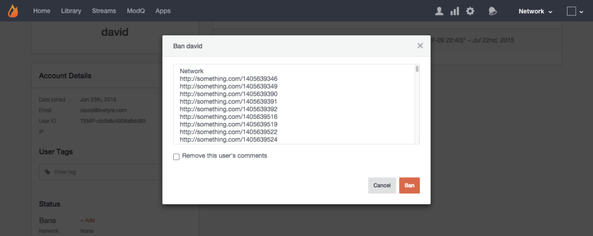

# Banir um usuário{#ban-a-user}

Você pode proibir os usuários em linha nos aplicativos do Livefyre, e os usuários conectados pelo Livefyre podem ser proibidos na página Biblioteca do Studio > Conteúdo do aplicativo.

Para proibir um usuário na página Usuários:

1. Clique em **[!UICONTROL +Add]** para **[!UICONTROL Bans]**.
1. Será exibido um pop-up que permite proibir o usuário de toda a rede ou de um site específico. (Use a tecla CTR ou Command para selecionar vários sites.)
1. Clique em **[!UICONTROL Remove this user’s comments]** para proibir o usuário, faça zoom em todas as publicações anteriores e remova-as do fluxo. Deixe essa caixa desmarcada para Bozo somente para publicações futuras do usuário banido.
1. Clique em **[!UICONTROL Ban]** para concluir o processo.
