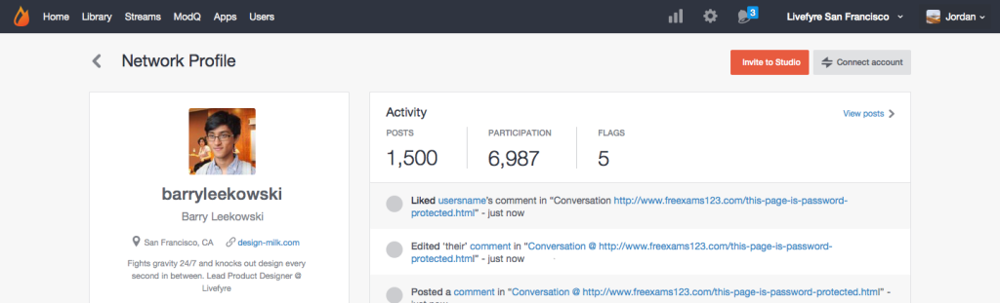

# Vincular contas de usuário{#link-user-accounts}

Vincule sua conta do Studio à sua conta do Livefyre para moderar ou gerenciar todos os sites ou redes do Livefyre de um único local.

>[!NOTE]
>
>Para interagir com um aplicativo Livefyre (por exemplo, deixar um comentário, adicionar um Sidenote ou compartilhar conteúdo), você deve fazer logon usando seu nome de usuário e senha da conta do Livefyre, e não seu nome de usuário e senha da conta do Studio.

Para vincular contas:

1. Faça logon no Studio depois de criar um perfil de usuário do Livefyre na rede.
1. Vá para **[!UICONTROL Users]**, localize o Perfil do usuário e clique duas vezes para visualizar os detalhes.
1. Clique **[!UICONTROL Connect account]**em.
1. Na janela aberta, selecione a conta de usuário a ser vinculada a esta conta.
1. Confirme as **[!UICONTROL Link Profile]** informações e clique **[!UICONTROL Link]**em. 

